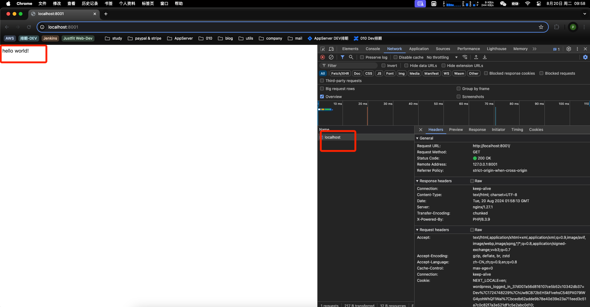
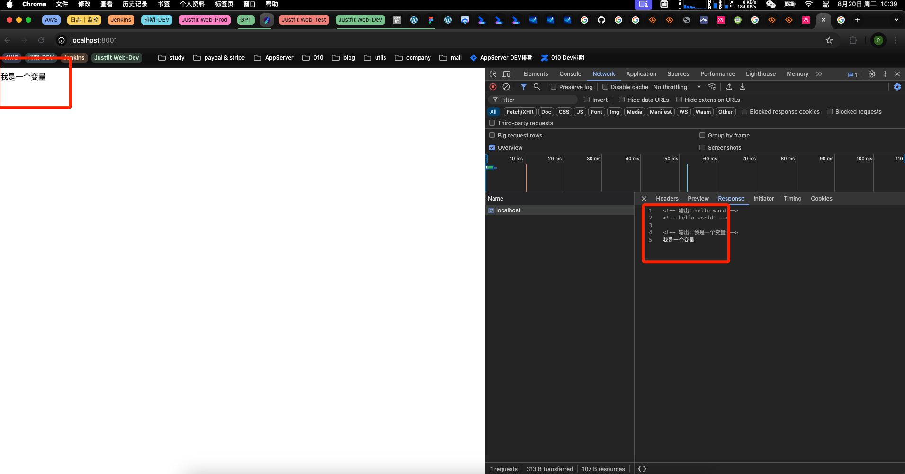

# <a id="top"></a>Day 1 - 初识 PHP

## 什么是 PHP？

PHP，全称 **Hypertext Preprocessor**（超文本预处理器），是一种通用的开源脚本语言。

### PHP 的特性

1. **服务器端执行**：PHP 脚本在服务器上运行，返回生成的 HTML。
2. **嵌入式设计**：PHP 可以直接嵌入到 HTML 中，允许开发者在网页中实现动态内容。
3. **跨平台兼容**：可以在几乎所有主流操作系统上运行。
4. **广泛的数据库支持**：支持大多数主流数据库。
5. **功能丰富**：应用广泛，易于上手，适合快速开发。

## Hello World 示例

### 如何运行？

1. **安装环境**：安装 Nginx 和 PHP 环境。本文只介绍OS系统下安装命令。
    ```bash
    brew install nginx
    brew install php
    ```
2. **配置 Nginx**：更新配置增量文件以支持 PHP。

   ```nginx
   server {
       listen       8001;
       server_name  localhost;

       # PHP 项目的根目录
       root /path/to/21challenge/code;

       index index.php index.html index.htm;

       location / {
           try_files $uri $uri/ /index.php$is_args$args;
       }

       # 处理 PHP 文件的部分
       location ~ \.php$ {
           include fastcgi_params;
           fastcgi_param SCRIPT_FILENAME $document_root$fastcgi_script_name;
           fastcgi_pass 127.0.0.1:9000;  # PHP-FPM 默认监听端口
           fastcgi_index index.php;
       }
   }
3. **创建第一个 PHP 文件**

    ```php
    <?php
        echo 'Hello, World!';
4. **Hello world**
    配置好 Nginx 监听 8001 端口后，
    在浏览器中访问 http://localhost:8001，
    Nginx 会请求根目录下的 index.php 文件，
    从而实现第一个 PHP “Hello World!”.
    
    
## 变量声明

**在 PHP 中，变量是赋值后创建的，不需要事先声明类型。
这是 PHP 动态类型的一个重要特性。**

1. **基本格式**：使用 **$** 声明
    ```php
    <?php
        $name = "Hello, PHP!"; // good
        $_name = "Hello, PHP!" // good
        $6name = "Hello, PHP!" // bad
    ```
2. **变量命名规则**
    - 大小写敏感;
    - 有效字符: 变量名可以字母和下划线开头，不允许数字开头；
    - 命名习惯：驼峰或下划线（my_name）命名法。
3. **尝试在页面上通过变量输出 "我是一个变量"**
    ```php
    <?php
        $name = '我是一个变量';
        echo $name;
    ?>
    ```
    
    
<a style="margin-left:90%;"></a>[返回顶部](#top)