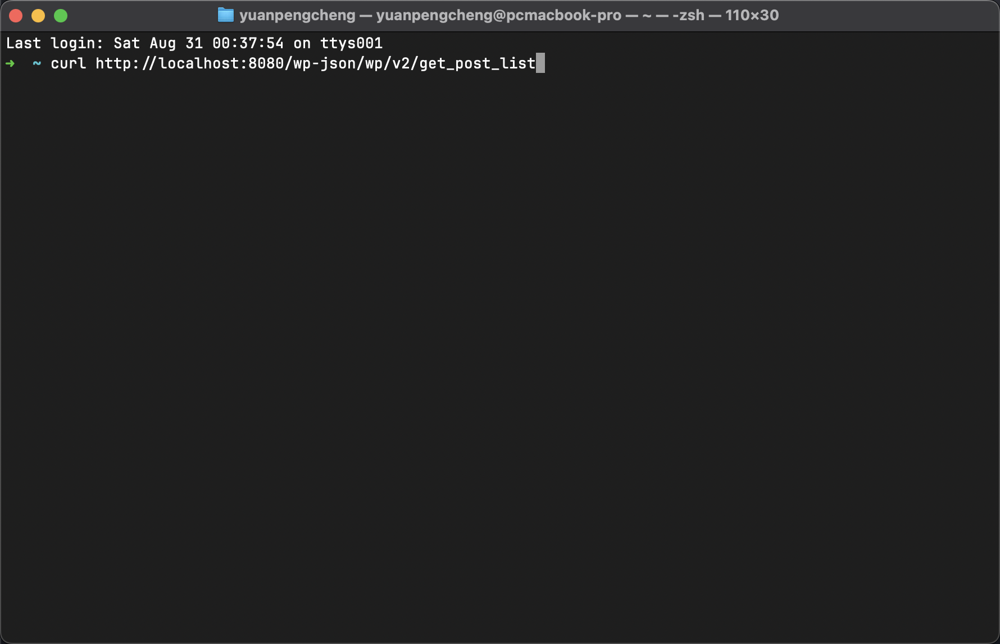
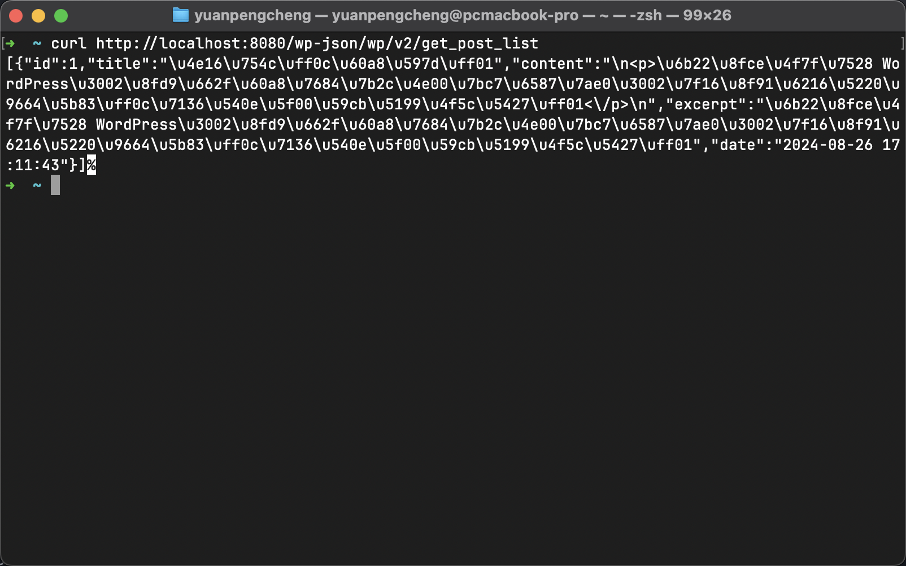
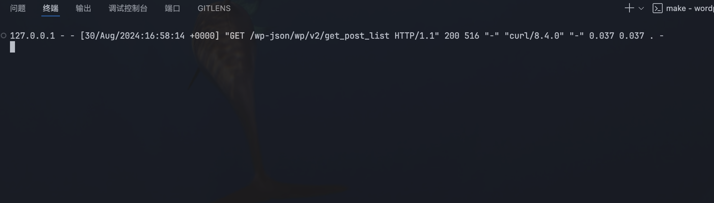

# Day  11 - Wordpress｜REST API

## REST API
WordPress REST API 是一个强大的功能，它允许开发者通过 JSON 格式访问和操作 WordPress 网站的数据。
REST API是一种软件架构风格，使用HTTP请求来访问和处理资源。**资源通常以JSON格式表示，使其易于跨平台使用**

## API 端点
- URL中的路径，用于访问或操作特定资源。
- WordPress默认的API端点通常以/wp-json/wp/v2/为基础路径。
1. 常用API 端点
   - `GET /wp-json/wp/v2/posts`: 获取文章
   - `POST /wp-json/wp/v2/posts`: 创建文章
   - `PUT /wp-json/wp/v2/posts/{id}`: 更新文章
   - `GET /wp-json/wp/v2/categories`: 获取分类
   - `GET /wp-json/wp/v2/categories`: 获取分类
   - `GET /wp-json/wp/v2/tags`: 获取标签
  
## 自定义API端点
wordpress提供了hook：rest_api_init和register_rest_route，用来创建新的API端点。
在theme/twentytewntyfour/functions.php中添加
```php
add_action('rest_api_init', function () {
    register_rest_route('wp/v2', '/get_post_list', array(
        'methods' => 'GET',
        'callback' => 'get_post_list',
        'permission_callback' => '__return_true', // 默认为所有用户允许访问
    ));
});

function get_post_list($request) {
    // 设置查询参数
    $args = array(
        'post_type' => 'post',   // 默认获取文章（可以根据需要调整）
        'post_status' => 'publish', // 仅获取已发布的文章
        'numberposts' => -1,    // 获取所有文章
    );

    // 执行查询以获取文章
    $posts = get_posts($args);

    // 如果没有文章，返回空数组
    if (empty($posts)) {
        return new WP_REST_Response(array(), 200);
    }

    // 创建用于存储格式化文章数据的数组
    $response = array();

    foreach ($posts as $post) {
        $response[] = array(
            'id' => $post->ID,
            'title' => get_the_title($post->ID),
            'content' => apply_filters('the_content', $post->post_content), // 格式化内容
            'excerpt' => get_the_excerpt($post->ID),
            'date' => $post->post_date,
        );
    }

    // 返回格式化数据
    return new WP_REST_Response($response, 200);
}
```

**通过curl访问该接口**

**相应内容**

服务收到接口相应，**输出日志**
