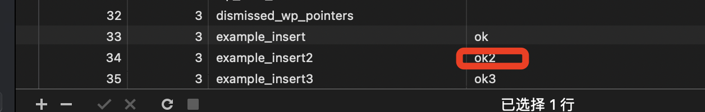

# Day  12 - SQL

前几天学习了Wordpress的安装、数据库交互、Hooks（Action和Filter）、踩坑经验以及REST API之后，对于Wordpress的使用上有了一定的体会，但是在实际操作中发现在数据库操作，尤其对于数据库的CURL对于一个前端开发，对于数据库需要更深入的学习，Day12的学习内容将围绕SQL进行。


## SQL
SQL（Structured Query Language）是一种用于访问和操作数据库的标准化语言。

## 数据库可视化工具
Navicat

## 数据库
- db: mysql
- dbname: wordpress-study
- 表：本次学习使用wp_usermeta表


## 基础SQL操作
- **查询**
   1. 基本查询
   ```sql
   # 基本语法 SELECT column1, column2 FROM table_name;
   SELECT meta_key FROM wp_usermeta;
   ```
   
   2. 条件查询
    ```sql
    # 基本语法 SELECT column1, column2 FROM table_name WHERE condition;
    SELECT meta_key FROM wp_usermeta WHERE meta_key=nickname;
    ```
    
   3. 排序查询
    ```sql
    # 基本语法 SELECT column1, column2 FROM table_name ORDER BY column1 DESC;
    # 根据umeta_id降序查找
    SELECT umeta_id FROM wp_usermeta ORDER BY umeta_id DESC;
    ```
    
    4. 聚合函数（如COUNT, SUM, AVG）：
    ```sql
    # COUNT: 计算行的数量,常用于统计满足特定条件的行数
    # 基本语法 SELECT COUNT(column1) FROM table_name;
    SELECT COUNT(umeta_id) FROM wp_usermeta;
    ```
    
- **插入**
  1. 插入单行数据
  ```sql
  # 基本语法 INSERT INTO table_name (column1, column2) VALUES (value1, value2);
    INSERT INTO wp_usermeta (umeta_id, user_id,meta_key,meta_value) VALUES (33, 3, 'example_insert', 'ok');
  ```
  
  
  2. 插入多行数据
  ```sql
  # 基本语法 INSERT INTO table_name (column1, column2) VALUES (value1, value2), (value3, value4);
  INSERT INTO wp_usermeta (umeta_id, user_id,meta_key,meta_value) VALUES (34, 3, 'example_insert2', 'ok2'),(35, 3, 'example_insert3', 'ok3');
  ```
  
- 更新数据
  ```sql
  # 基本语法 UPDATE table_name SET column1 = value1 WHERE condition;
  UPDATE wp_usermeta SET meta_value = 'ok_update' WHERE umeta_id = 34;
  ```
  
  
- 删除数据
  ```sql
  # 基本语法 DELETE FROM table_name WHERE condition;
  DELETE FROM wp_usermeta WHERE meta_value = 'ok_update';
  ```
  
  
  
## 案例分析
```sql
SELECT t.name AS category_name, p.post_title 
FROM wp_term_taxonomy tt
JOIN wp_terms t ON tt.term_id = t.term_id
JOIN wp_term_relationships tr ON tt.term_taxonomy_id = tr.term_taxonomy_id
JOIN wp_posts p ON tr.object_id = p.ID
WHERE tt.taxonomy = 'category';
```

**这段SQL用来查询每篇文章的标题和其所属分类名称**

- 来源表wp_term_taxonomy并重命名为tt
- 通过term_id关联表wp_term_taxonomy和表wp_terms并重命名wp_terms为t
- 通过term_taxonomy_id关联表wp_term_taxonomy和表wp_term_relationships并重命名wp_term_relationships为tr
- 通过object_id关联表wp_term_taxonomy和表wp_posts并重命名wp_posts为p
- ```t.name AS category_name```,获取wp_terms中的name并重命名为category_name，```p.post_title```获取wp_posts表中的post_title
- ```tt.taxonomy = 'category'```,查找所有wp_term_taxonomy中taxonomy为category的内容，联表查询获取category_name和post_title
