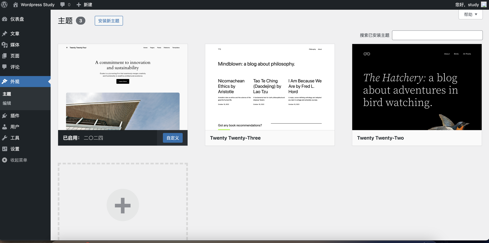
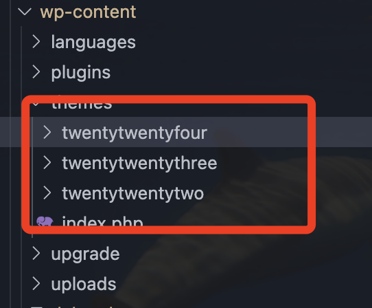
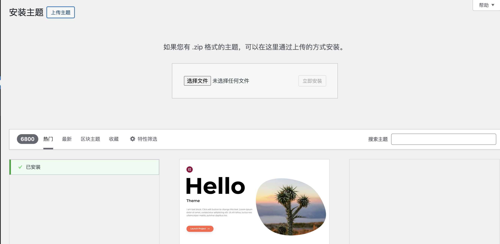
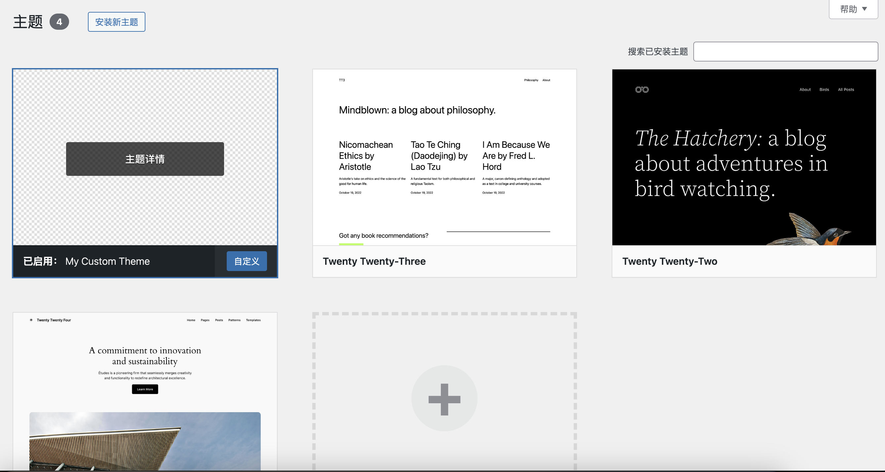
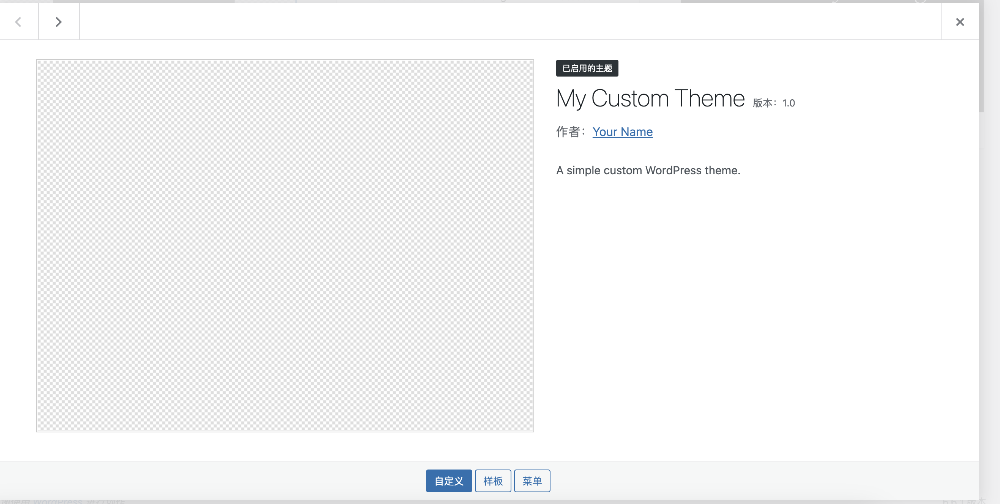
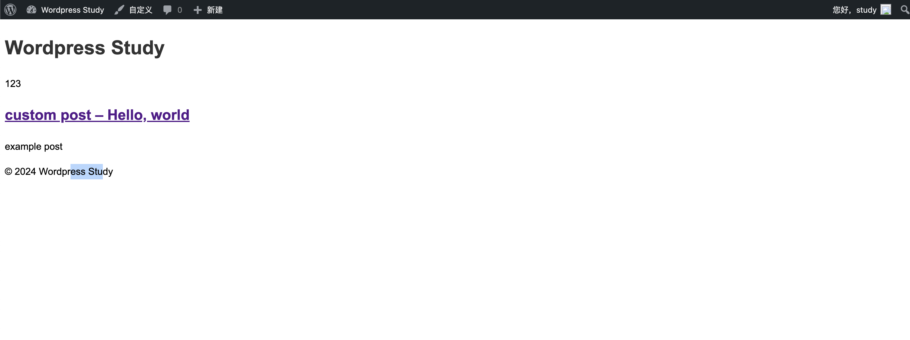

# Day  13 - Wordpress｜自定义主题开发

## 主题
主题是WordPress灵活性和可自定义性的核心之一，其特性包括以用户体验为核心、保持品牌一致性、实现简洁与功能性的平衡、具备SEO优化能力以及确保可拓展性。

## 官方主题

**在wordpress6.6.1中，默认提供三种主题，分别是twentytwentyfour，twentytwentythree，twentytwentytwo**


## 自定义简易主题
由于主题是可以脱离项目单独开发的，所以有两种方式运行自定义主题，一种是在项目中直接定义，另一种则可以通过界面上传自定义主题。
**通过zip压缩文件上传主题方式**


**开发**
1. 在`/wp-content/themes`目录下新建一个目录`customtheme`
2. 添加基础文件：style.css（定义主题的样式），index.php（主题的主页模板），functions.php（添加功能和hook）等。
  - ```style.css```中除了基本的css代码我们可以通过注释模版的形式，给主题在界面上添加描述内容。
    ```
    /*
      Theme Name: 主题名称
      Theme URI: 主题源代码地址
      Author: 作者
      Author URI: 作者地址
      Description: 描述
      Version: 版本号
      License: xx
      License URI: xx
      Text Domain: my-custom-theme
    */
    ```
  - 在```index.php```中添加关于页面内容的html描述
    ```html
      <!DOCTYPE html>
        <html <?php language_attributes(); ?>>

        <head>
            <meta charset="<?php bloginfo('charset'); ?>">
            <meta name="viewport" content="width=device-width, initial-scale=1.0">
            <title><?php wp_title('|', true, 'right');
                    bloginfo('name'); ?></title>
            <link rel="stylesheet" href="<?php echo get_stylesheet_uri(); ?>">
            <?php wp_head(); ?>
        </head>

        <body <?php body_class(); ?>>

            <header>
                <h1><?php bloginfo('name'); ?></h1>
                <p><?php bloginfo('description'); ?></p>
            </header>

            <main>
                <?php if (have_posts()) : while (have_posts()) : the_post(); ?>
                        <article>
                            <h2><a href="<?php the_permalink(); ?>"><?php the_title(); ?></a></h2>
                            <div><?php the_content(); ?></div>
                        </article>
                    <?php endwhile;
                else : ?>
                    <p><?php _e('Sorry, no posts matched your criteria.'); ?></p>
                <?php endif; ?>
            </main>

            <footer>
                <p>&copy; <?php echo date('Y'); ?> <?php bloginfo('name'); ?></p>
            </footer>

            <?php wp_footer(); ?>
        </body>
      </html>
    ```
打开主题



访问localhost:8080
