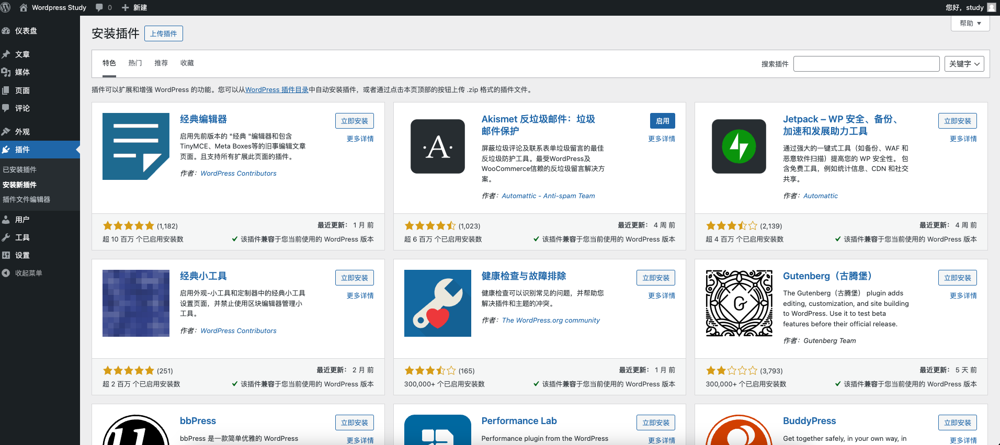
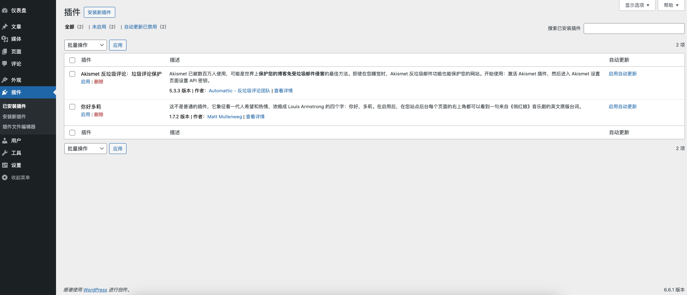
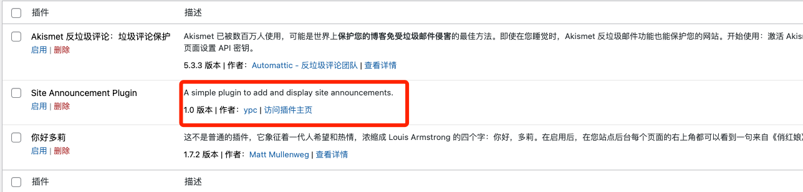
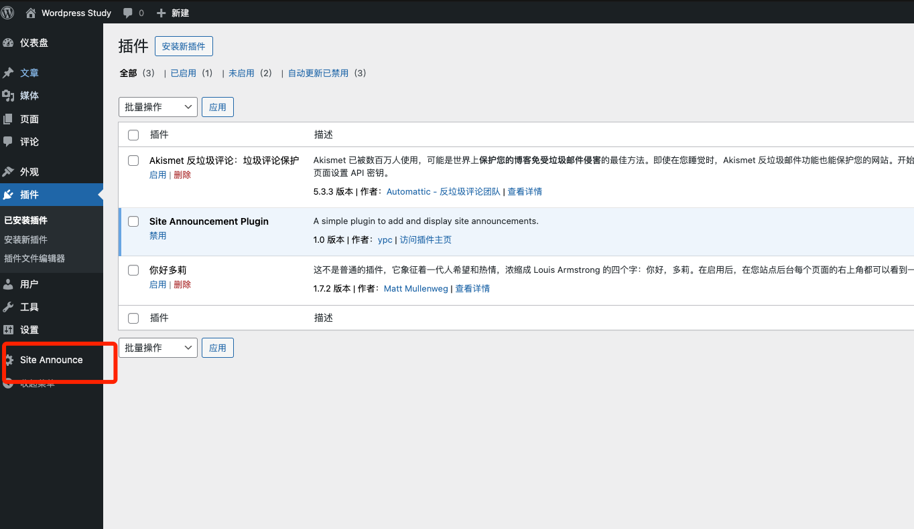
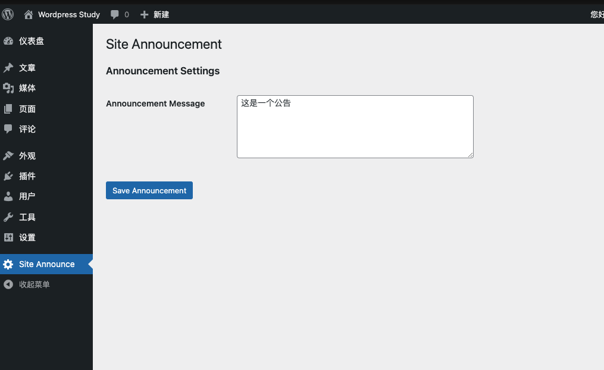
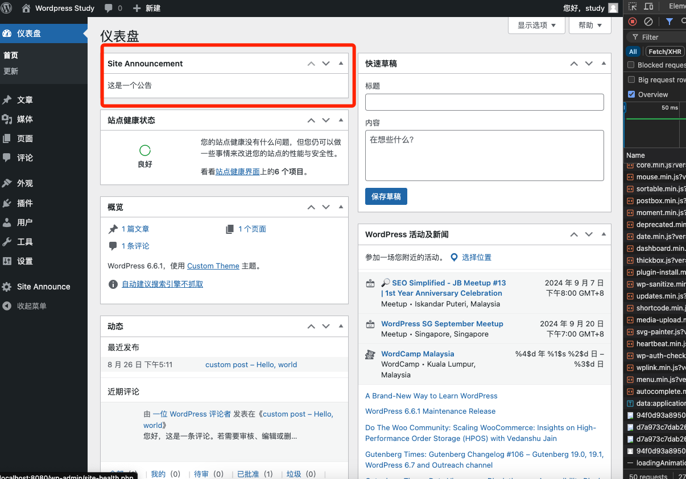

# Day  14 - Wordpress｜自定义插件开发
上一节学习了如何开发一个自定义主题，本章研究开发一个自定义插件
## plugins

WordPress 插件是一种软件组件，可以添加到WordPress中以扩展其功能和特性。插件允许用户通过添加新的功能或改进现有功能而无需触及核心代码或主题文件，从而大大提高了 WordPress 的灵活性和可扩展性。

**WordPress提供了插件库给用户使用**


**插件支持安装、激活、停用、删除、更新，灵活通用**


**支持自定义开发**
自定义开发的插件一般放在wp-content/plugins下，今天研究开发一个自定义的网站公告插件。


**网站公告插件**
网站公告插件在CMS管理平台非常实用，可以通知所有用户相应的内容。

1. 在wp-content/plugins/下新建目录site-announcement-plugin
2. 创建```index.php```并加入代码，防止直接访问php文件
    ```php
    <?php
    ```
3. 创建```main.php```放置插件核心代码
   - 添加描述信息php,这会在页面上显示相应的信息
   ```
   <?php
    /*
        Plugin Name: Site Announcement Plugin
        Plugin URI: http://example.com
        Description: A simple plugin to add and display site announcements.
        Version: 1.0
        Author: ypc
        Author URI: http://yourwebsite.com
        License: GPL2
    */
   ```
   
   - 创建菜单目录
   ```php
    // wordpress提供了hook，方便开发者增加新的菜单目录
    function sap_add_admin_menu()
    {
        add_menu_page(
            'Site Announce', // Page title
            'Site Announce', // Menu title
            'manage_options',    // Capability
            'site-announcement', // Menu slug
            'sap_options_page'   // Callback function
        );
    }
    add_action('admin_menu', 'sap_add_admin_menu');
    // Display settings page
    function sap_options_page() {
        ?>
        <div class="wrap">
            <h1>Site Announcement</h1>
            <form action="options.php" method="post">
                <?php
                settings_fields('sap_options');
                do_settings_sections('site-announcement');
                submit_button('Save Announcement');
                ?>
            </form>
        </div>
        <?php
    }
   ```
   
   - 注册设置，保存公告信息
   ```php
    function sap_settings_init() {
        register_setting('sap_options', 'sap_options', 'sanitize_callback');

        add_settings_section(
            'sap_section',
            'Announcement Settings',
            null,
            'site-announcement'
        );

        add_settings_field(
            'sap_text_field',
            'Announcement Message',
            'sap_text_field_render',
            'site-announcement',
            'sap_section'
        );
    }
    // 设置页面字段
    add_action('admin_init', 'sap_settings_init');
    function sap_text_field_render() {
        $options = get_option('sap_options');
        ?>
        <textarea cols='50' rows='5' name='sap_options[sap_text_field]'><?php echo isset($options['sap_text_field']) ? esc_textarea($options['sap_text_field']) : ''; ?></textarea>
        <?php
    }
   ```
   - 创建简码显示公告
   ```php
   // 通过hook加入首页
    add_action('wp_dashboard_setup', 'daw_add_dashboard_widgets');
    // 添加到首页什么位置显示
    function daw_add_dashboard_widgets()
    {
        wp_add_dashboard_widget(
            'daw_dashboard_widget',          // Widget slug
            'Site Announcement',             // Title
            'daw_dashboard_widget_display'   // Display function
        );
    }
    // 回调函数，显示内容
    function daw_dashboard_widget_display()
    {
        $announcement = get_option('sap_options');

        if (isset($announcement['sap_text_field']) && !empty($announcement['sap_text_field'])) {
            echo '<div>' . esc_html($announcement['sap_text_field']) . '</div>';
        } else {
            echo '<div>No announcement set.</div>';
        }
    }
   ```
   
   
    