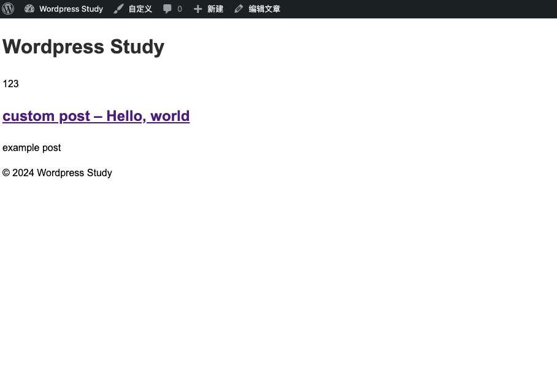
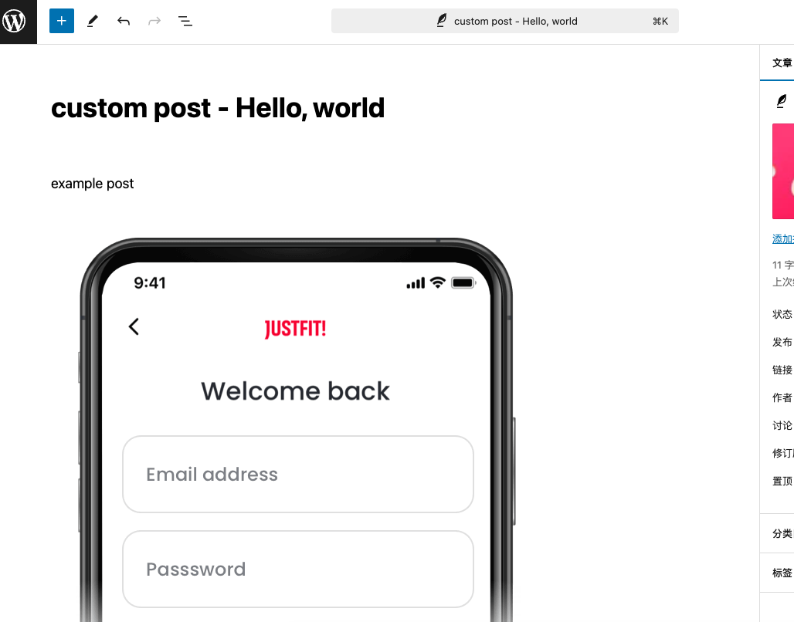
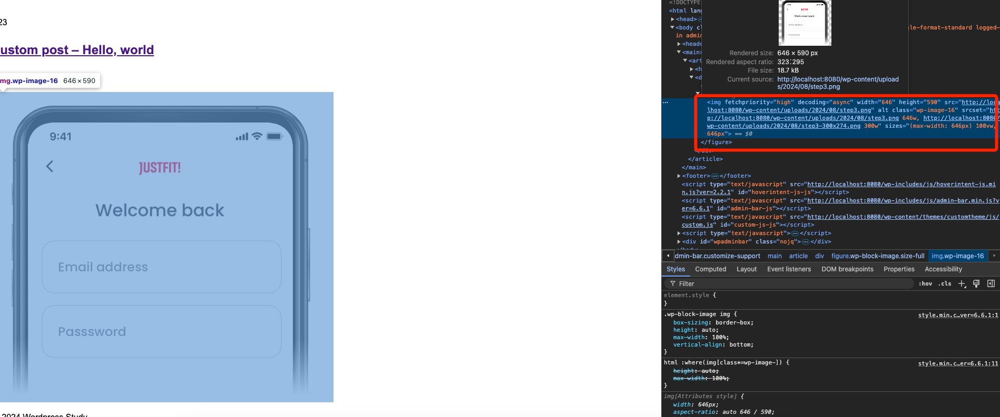

# Day15 - Wordpress｜魔改srcset
前几章我们学习了wordpress的很多的hook，这些hook方便我们在需要的时机加入自己的逻辑，本次我将研究如果重写图片的srcset。

## wordpress post的文章
**借助上一章的文章继续开发**

**我们进入文章编辑页面**，**上传一张图片后保存**

**预览**，用过右键打开控制台发现wordpress针对图片做了一些自适应的属性


**对应的源码是wp_calculate_image_srcset方法，用来处理src以及srcset等图片属性，生成响应式图像的srcset**
```php
function wp_calculate_image_srcset( $size_array, $image_src, $image_meta, $attachment_id = 0 ) {
	/**
	 * Pre-filters the image meta to be able to fix inconsistencies in the stored data.
	 *
	 * @since 4.5.0
	 *
	 * @param array  $image_meta    The image meta data as returned by 'wp_get_attachment_metadata()'.
	 * @param int[]  $size_array    {
	 *     An array of requested width and height values.
	 *
	 *     @type int $0 The width in pixels.
	 *     @type int $1 The height in pixels.
	 * }
	 * @param string $image_src     The 'src' of the image.
	 * @param int    $attachment_id The image attachment ID or 0 if not supplied.
	 */
	$image_meta = apply_filters( 'wp_calculate_image_srcset_meta', $image_meta, $size_array, $image_src, $attachment_id );

	if ( empty( $image_meta['sizes'] ) || ! isset( $image_meta['file'] ) || strlen( $image_meta['file'] ) < 4 ) {
		return false;
	}

	$image_sizes = $image_meta['sizes'];

	// Get the width and height of the image.
	$image_width  = (int) $size_array[0];
	$image_height = (int) $size_array[1];

	// Bail early if error/no width.
	if ( $image_width < 1 ) {
		return false;
	}

	$image_basename = wp_basename( $image_meta['file'] );

	/*
	 * WordPress flattens animated GIFs into one frame when generating intermediate sizes.
	 * To avoid hiding animation in user content, if src is a full size GIF, a srcset attribute is not generated.
	 * If src is an intermediate size GIF, the full size is excluded from srcset to keep a flattened GIF from becoming animated.
	 */
	if ( ! isset( $image_sizes['thumbnail']['mime-type'] ) || 'image/gif' !== $image_sizes['thumbnail']['mime-type'] ) {
		$image_sizes[] = array(
			'width'  => $image_meta['width'],
			'height' => $image_meta['height'],
			'file'   => $image_basename,
		);
	} elseif ( str_contains( $image_src, $image_meta['file'] ) ) {
		return false;
	}

	// Retrieve the uploads sub-directory from the full size image.
	$dirname = _wp_get_attachment_relative_path( $image_meta['file'] );

	if ( $dirname ) {
		$dirname = trailingslashit( $dirname );
	}

	$upload_dir    = wp_get_upload_dir();
	$image_baseurl = trailingslashit( $upload_dir['baseurl'] ) . $dirname;

	/*
	 * If currently on HTTPS, prefer HTTPS URLs when we know they're supported by the domain
	 * (which is to say, when they share the domain name of the current request).
	 */
	if ( is_ssl() && ! str_starts_with( $image_baseurl, 'https' ) && parse_url( $image_baseurl, PHP_URL_HOST ) === $_SERVER['HTTP_HOST'] ) {
		$image_baseurl = set_url_scheme( $image_baseurl, 'https' );
	}

	/*
	 * Images that have been edited in WordPress after being uploaded will
	 * contain a unique hash. Look for that hash and use it later to filter
	 * out images that are leftovers from previous versions.
	 */
	$image_edited = preg_match( '/-e[0-9]{13}/', wp_basename( $image_src ), $image_edit_hash );

	/**
	 * Filters the maximum image width to be included in a 'srcset' attribute.
	 *
	 * @since 4.4.0
	 *
	 * @param int   $max_width  The maximum image width to be included in the 'srcset'. Default '2048'.
	 * @param int[] $size_array {
	 *     An array of requested width and height values.
	 *
	 *     @type int $0 The width in pixels.
	 *     @type int $1 The height in pixels.
	 * }
	 */
	$max_srcset_image_width = apply_filters( 'max_srcset_image_width', 2048, $size_array );

	// Array to hold URL candidates.
	$sources = array();

	/**
	 * To make sure the ID matches our image src, we will check to see if any sizes in our attachment
	 * meta match our $image_src. If no matches are found we don't return a srcset to avoid serving
	 * an incorrect image. See #35045.
	 */
	$src_matched = false;

	/*
	 * Loop through available images. Only use images that are resized
	 * versions of the same edit.
	 */
	foreach ( $image_sizes as $image ) {
		$is_src = false;

		// Check if image meta isn't corrupted.
		if ( ! is_array( $image ) ) {
			continue;
		}

		// If the file name is part of the `src`, we've confirmed a match.
		if ( ! $src_matched && str_contains( $image_src, $dirname . $image['file'] ) ) {
			$src_matched = true;
			$is_src      = true;
		}

		// Filter out images that are from previous edits.
		if ( $image_edited && ! strpos( $image['file'], $image_edit_hash[0] ) ) {
			continue;
		}

		/*
		 * Filters out images that are wider than '$max_srcset_image_width' unless
		 * that file is in the 'src' attribute.
		 */
		if ( $max_srcset_image_width && $image['width'] > $max_srcset_image_width && ! $is_src ) {
			continue;
		}

		// If the image dimensions are within 1px of the expected size, use it.
		if ( wp_image_matches_ratio( $image_width, $image_height, $image['width'], $image['height'] ) ) {
			// Add the URL, descriptor, and value to the sources array to be returned.
			$source = array(
				'url'        => $image_baseurl . $image['file'],
				'descriptor' => 'w',
				'value'      => $image['width'],
			);

			// The 'src' image has to be the first in the 'srcset', because of a bug in iOS8. See #35030.
			if ( $is_src ) {
				$sources = array( $image['width'] => $source ) + $sources;
			} else {
				$sources[ $image['width'] ] = $source;
			}
		}
	}

	/**
	 * Filters an image's 'srcset' sources.
	 *
	 * @since 4.4.0
	 *
	 * @param array  $sources {
	 *     One or more arrays of source data to include in the 'srcset'.
	 *
	 *     @type array $width {
	 *         @type string $url        The URL of an image source.
	 *         @type string $descriptor The descriptor type used in the image candidate string,
	 *                                  either 'w' or 'x'.
	 *         @type int    $value      The source width if paired with a 'w' descriptor, or a
	 *                                  pixel density value if paired with an 'x' descriptor.
	 *     }
	 * }
	 * @param array $size_array     {
	 *     An array of requested width and height values.
	 *
	 *     @type int $0 The width in pixels.
	 *     @type int $1 The height in pixels.
	 * }
	 * @param string $image_src     The 'src' of the image.
	 * @param array  $image_meta    The image meta data as returned by 'wp_get_attachment_metadata()'.
	 * @param int    $attachment_id Image attachment ID or 0.
	 */
	$sources = apply_filters( 'wp_calculate_image_srcset', $sources, $size_array, $image_src, $image_meta, $attachment_id );

	// Only return a 'srcset' value if there is more than one source.
	if ( ! $src_matched || ! is_array( $sources ) || count( $sources ) < 2 ) {
		return false;
	}

	$srcset = '';

	foreach ( $sources as $source ) {
		$srcset .= str_replace( ' ', '%20', $source['url'] ) . ' ' . $source['value'] . $source['descriptor'] . ', ';
	}

	return rtrim( $srcset, ', ' );
}
```

## 问题
我的服务部署在 https://example.com/path1 下，但是我希望我的图片的src和srcset展示的是 https://example.com/wp-content/uploads/xxxx

因为wordpress在默认情况下是会跟随siteurl的地址去拼接img的url，因为图片的地址应该是 https://example.com/path1/wp-content/uploads/xxxx ，想要删除path1，可以通过hook的形式，去替换图片地址

**hack.php**
```php
<?php
require_once __DIR__ . '/functions.php';
// 替换image srcset地址 
$suffix = 'path1';
// hook wp_calculate_image_srcset
add_filter('wp_calculate_image_srcset', function (array $sources, array $size_array, string $image_src, array $image_meta, int $attachment_id): array {
    global $suffix;

    foreach ($sources as &$image) {
        if (!$image) {
            continue;
        }

        $image['url'] = hack_url($image['url'], $suffix) ?: $image['url'];
    }
    return $sources;
    // 10 执行优先级，数字越小越早执行，默认情况下，优先级为 10，可以用不同的优先级控制函数执行的顺序
    // 5 接受参数数量 WordPress 将传递给该回调函数五个参数：$sources, $size_array, $image_src, $image_meta, 和 $attachment_id。
}, 10, 5);

```
**functions.php**
```php
<?php
// 抽象hackurl方法
function hack_url($url, $suffix)
{
    $newUrl = '';

    if (!$url) {
        return;
    }
    // 使用 parse_url 函数解析 URL，获取路径部分
    $parsedUrl = parse_url($url);

    // 异常跳出
    if ($parsedUrl === false) {
        return;
    }
    if (empty($parsedUrl['scheme'])) {
        return;
    }
    if (empty($parsedUrl['host'])) {
        return;
    }

    // 获取其他 URL 组件
    $urlpath = $parsedUrl['path'];
    $scheme = $parsedUrl['scheme'];
    $host = $parsedUrl['host'];
    $port = isset($parsedUrl['port']) ? ':' . $parsedUrl['port'] : '';
    $query = isset($parsedUrl['query']) ? '?' . $parsedUrl['query'] : '';
    $fragment = isset($parsedUrl['fragment']) ? '#' . $parsedUrl['fragment'] : '';

    // 检查路径部分是否存在
    if (isset($urlpath)) {
        // 去掉路径前后的斜杠，并分割路径成数组
        $pathParts = explode('/', trim($urlpath, '/'));
        // 检查第一级目录是否是 "resources"，如果是则替换为空字符串
        if ($pathParts[0] === $suffix) {
            // 移除第一级目录
            array_shift($pathParts);
            // 重新组合路径
            $newPath = implode('/', $pathParts);
            // 构建新的 URL
            $newUrl = $scheme . '://' . $host . $port . '/' . $newPath . $query . $fragment;
            //替换后的 URL
        }
    }
    return $newUrl;
}

```
通过wp_calculate_image_srcset这个hook去执行我们自定义的函数，解析url，去除相应的path1。
