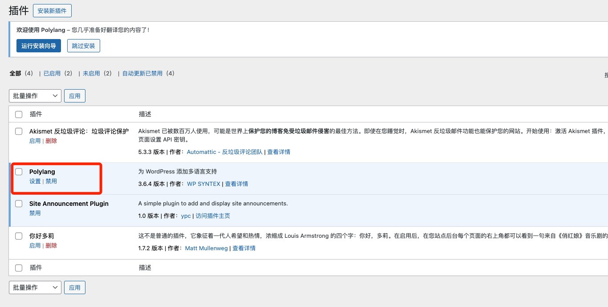
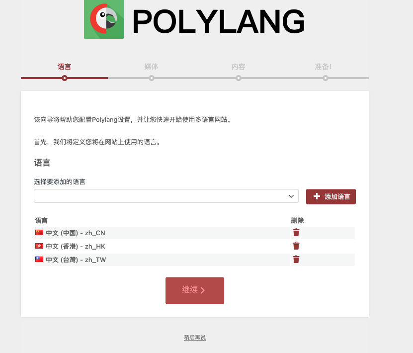
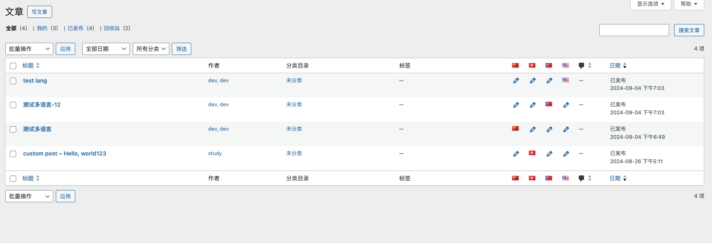
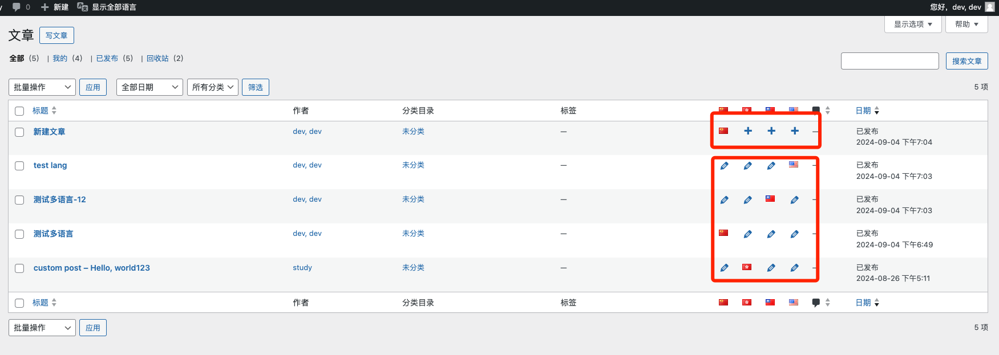

# Day16 - Wordpress｜Polylang

## 前言
在使用wordpress搭建网站的使用，多语言是一个必不可少的话题，wordpress提供了大量的插件支持多语言，本次学习多语言插件**polylang**

## 安装
1. 启动项目
2. 点击安装新插件，搜索polylang，点击安装

3. 点击设置
4. 选择语言，跟随引导完成基本配置

5. 编辑多语言文章

6. 通过点击➕进入页面编辑其他语言的内容

7. 点击查看文章
 

 
页面的path通过`en` `zh-tw` `zh-hk`等不同地区语言代号区分开了