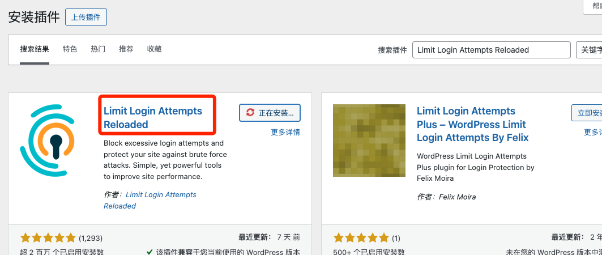
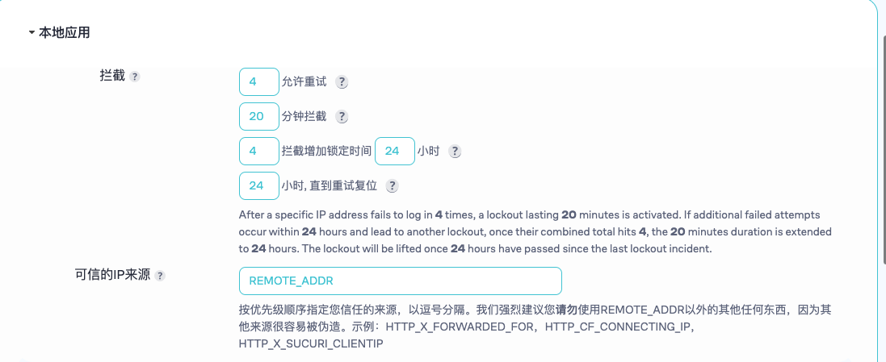
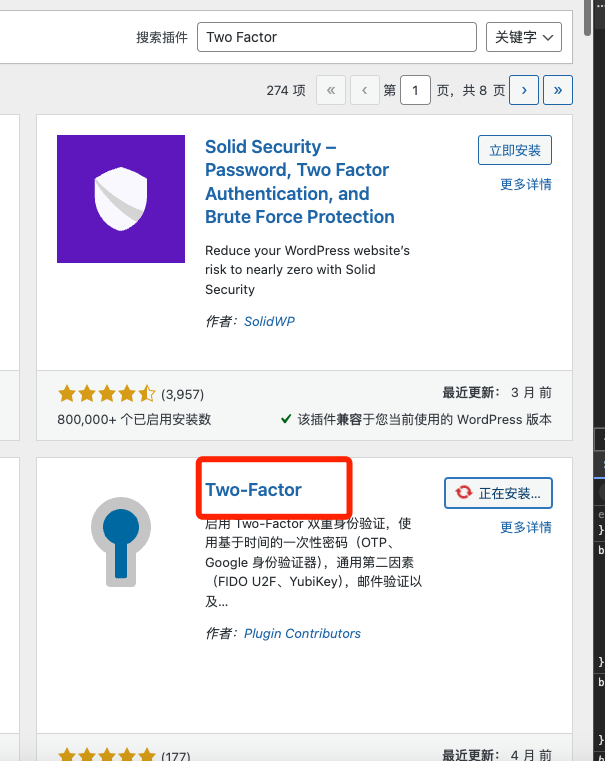
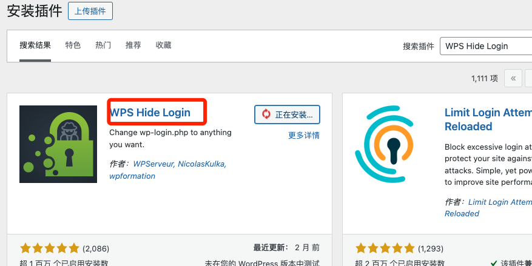
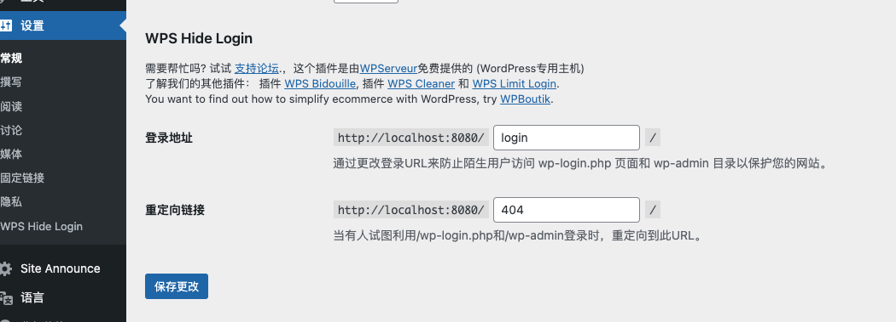
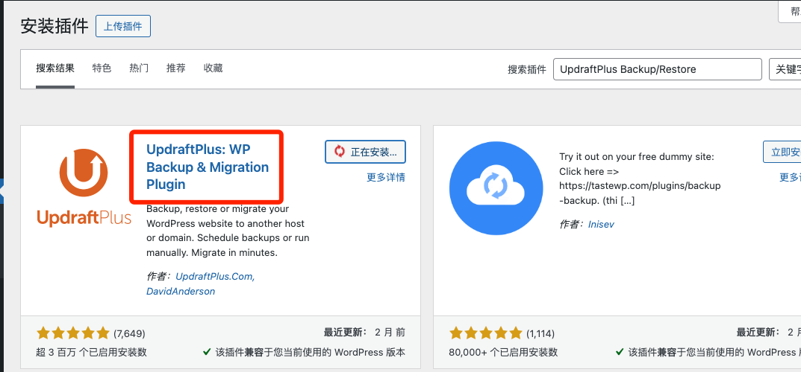
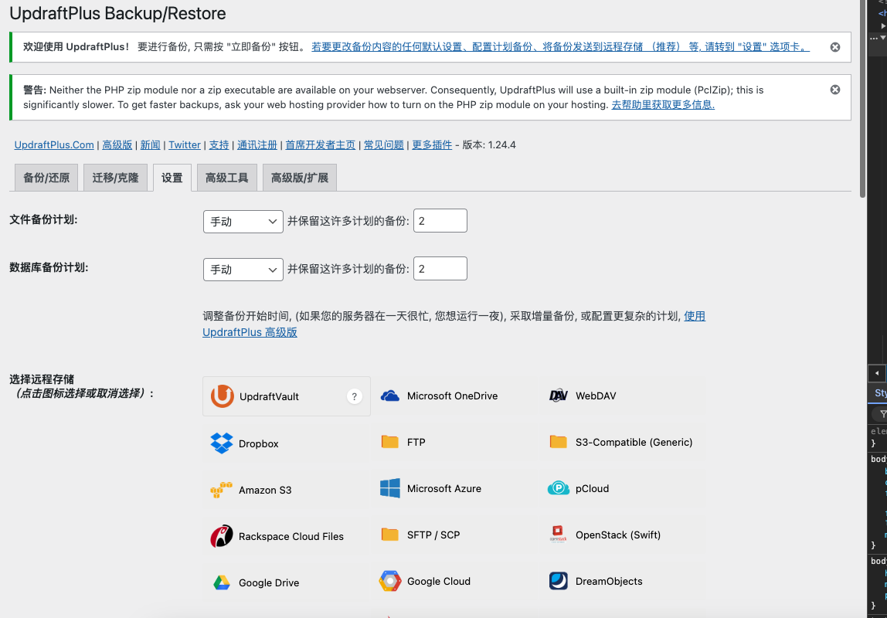
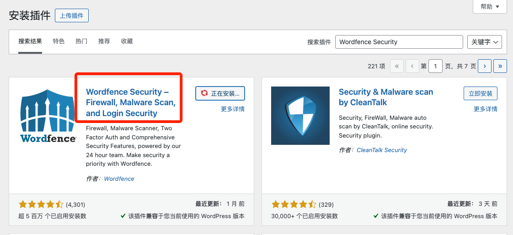
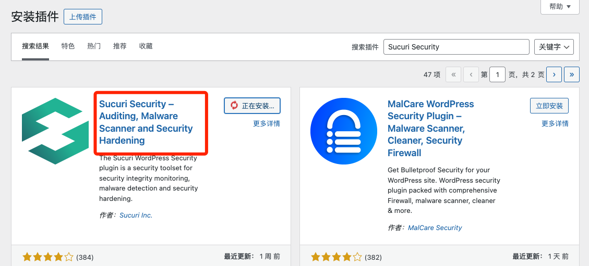
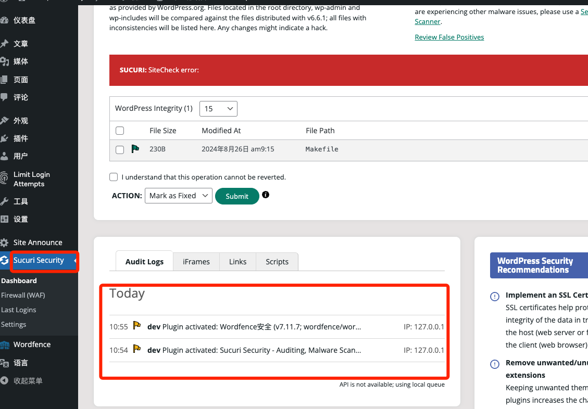

# Day17 - Wordpress｜安全性优化

## wordpress常见的安全性优化

1. 保持WordPress、主题和插件的更新
   - 登录到WordPress后台，进入仪表盘中的更新页面。检查是否有需要更新的WordPress版本、插件或主题，点击“**更新**”按钮进行更新
   - 涉及二次开发的代码需要小心升级，在升级前应该做好数据备份
   - 通过在wp-config.php中添加以下代码来自动更新：
    ```php
        // 启用插件和主题的自动更新
        add_filter('auto_update_plugin', '__return_true');
        add_filter('auto_update_theme', '__return_true');
    ```
2. 限制登录尝试
    - 从WordPress插件库中搜索“**Limit Login Attempts Reloaded**”插件，安装并激活。
    
    - 激活后，进入插件设置页面，设置最大登录尝试次数和锁定时间。如：尝试失败3次则锁定10分钟。
    

1. 实现双因素认证（2FA）
   - 搜索并安装“**Two Factor**”插件。
   
   - 在用户配置页面，启用“**Two Factor**”，根据说明设置**Google Authenticator**或其他可选项。

2. 更改默认的登录URL
   - 从插件库搜索“**WPS Hide Login**”，安装并激活。
   
   - **在插件设置中配置新的登录URL（如/my-new-login），以替代默认的/wp-login.php。**
   

3. 定期备份

   - 从插件库安装“**UpdraftPlus Backup/Restore**”插件。
   
   - 配置定期备份计划并选择备份文件存储位置，如Google Drive、Dropbox等。
   

4. 保护WordPress配置文件

    - 编辑文件：通过FTP或主机提供的文件管理器，编辑站点根目录中的.htaccess文件。

    - 添加保护规则：
        ```apache
        <Files wp-config.php>
            order allow,deny
            deny from all
        </Files>
        ```
5. 使用安全插件

    - 可以使用“**Wordfence Security（收费）**”或“**Sucuri Security**”
    
    
    - 进入插件设置页面，启用扫描并配置报警通知。
    

6. **防范SQL注入和XSS攻击**

    - 在自定义代码中处理用户输入时，始终使用WordPress的安全函数。例如：
    ```php
    global $wpdb;
    $safe_query = $wpdb->prepare("SELECT * FROM {$wpdb->prefix}table WHERE column = %s", $user_input);
    ```
   - 对输出进行适当转义：
   ```php
   echo esc_html($user_input);
   ```