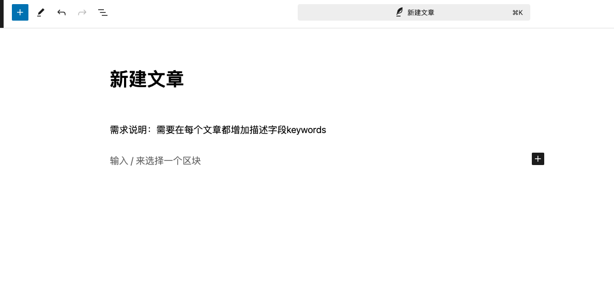
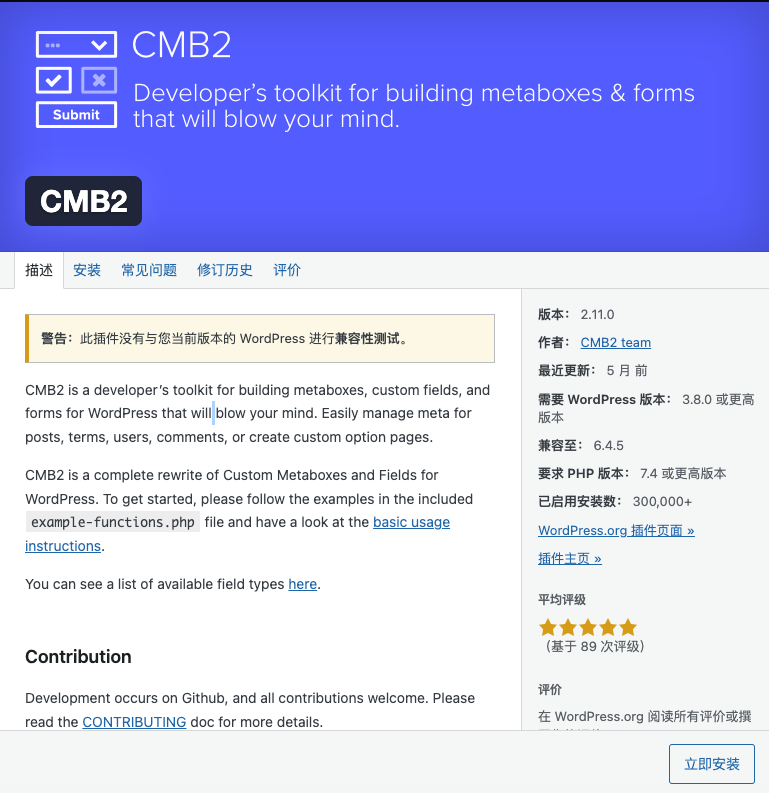
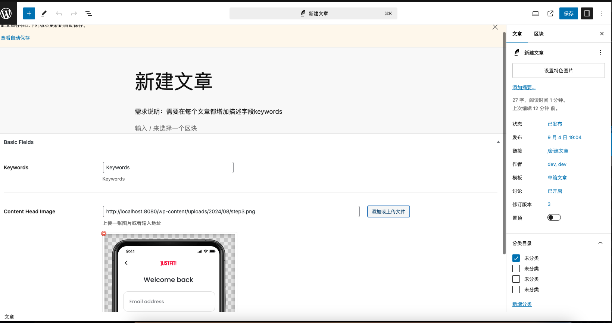
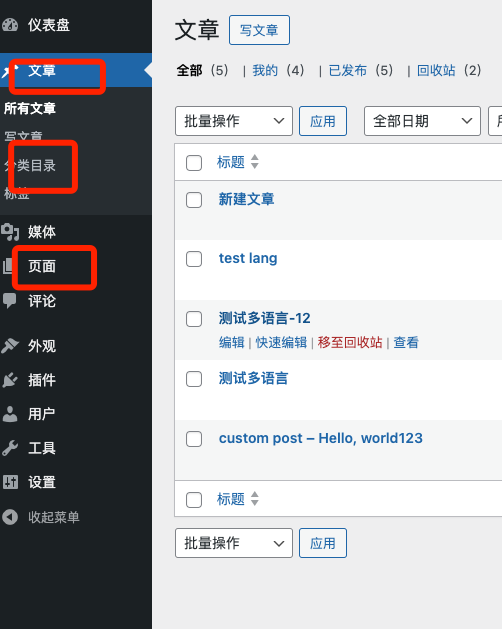

# Day18 - Wordpress｜添加文章自定义字段

## 需求说明
在每个文章都增加描述字段keywords和封面


## CMB2
CMB2 是一个用于 WordPress 的开发工具包，专注于构建元框、定制字段和表单。它帮助开发者轻松管理文章、术语、用户、评论的元数据，或创建自定义选项页面。

**主要功能：**
- 元框和自定义字段：允许开发者为不同类型的内容（如文章、页面、用户等）添加定制字段。
- 易于使用：通过预定义的示例和简单的函数调用即可创建复杂的表单和字段。
- 高扩展性：支持多种字段类型和选项，可以创建嵌套字段组。
- 集成和兼容性：即使是自定义开发需求也能通过扩展 API 高效实现。

**插件库搜索CMB2并安装激活**


## CMB2 语法
1. 生成一个cmb2容器
```php
// 生成一个cmb2容器
$cmb_demo = new_cmb2_box(array(
    'id' => 'basic_fields',
    'title' => esc_html__('Basic Fields', 'cmb2'),
    'object_types' => array('post'), // Post type
));
```
2. 向容器内添加字段
```php
// 向容器内添加字段，支持多种类型，也支持自定义开发类型，
// 参考cmb2plugins中的example-functions.php
$cmb_demo->add_field(array(
    'name' => esc_html__('Keywords', 'cmb2'), // 字段名称
    'desc' => esc_html__('Keywords', 'cmb2'), // 描述
    'id'   => 'content_keywords', // 唯一标识，不能重复
    'type' => 'text', // 类型
));
$cmb_demo->add_field(array(
    'name' => esc_html__('Content Head Image', 'cmb2'),
    'desc' => esc_html__('Upload an image or enter a URL.', 'cmb2'),
    'id'   => 'content_image',
    'type' => 'file',
));
```
3. 编辑文章
   
   
4. 支持文章、分类、Page等字段的添加
    