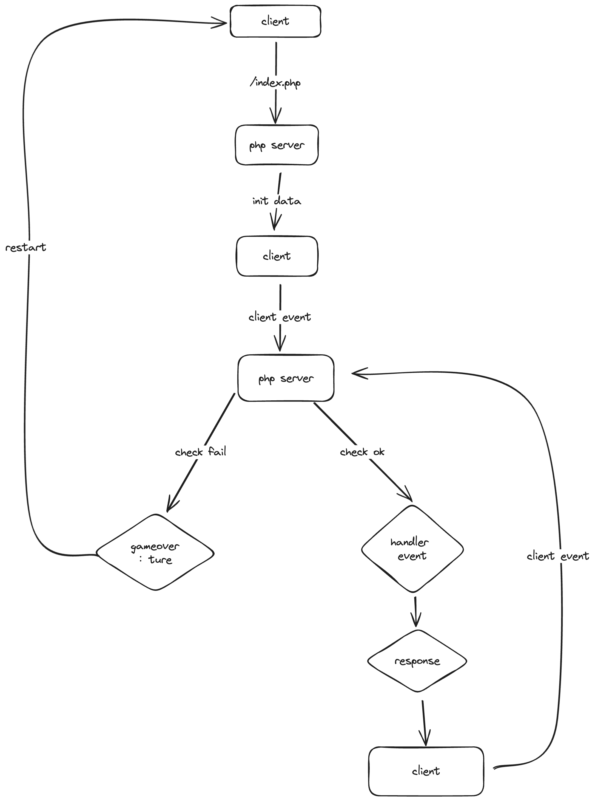
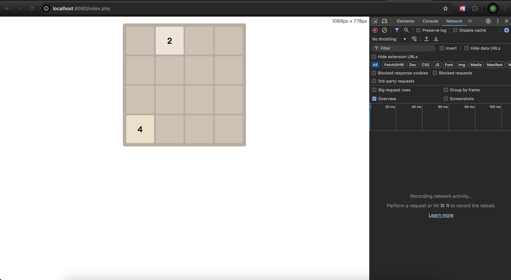
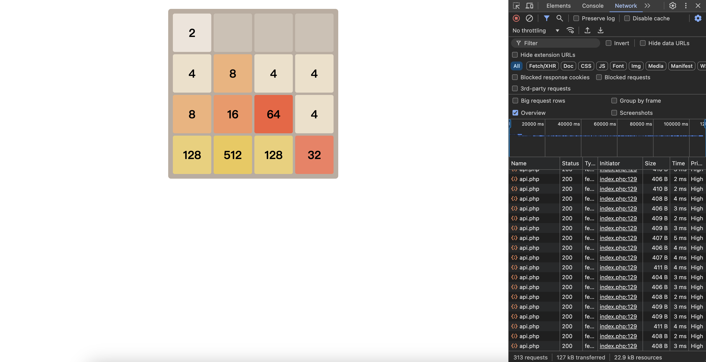
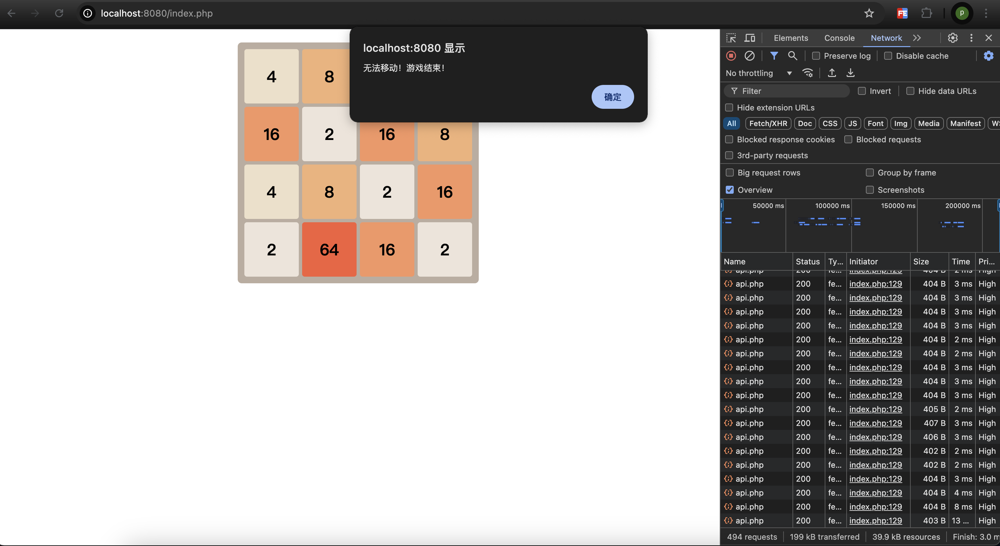

# Day19 - PHP 实现2048小游戏-1

### **实现思路**
1. PHP负责处理主逻辑，HTML、CSS、JS 负责UI 动画以及用户操作事件请求
2. 棋盘：4 * 4，PHP接口返回二维数组和当前状态给客户端用于页面展示
3. PHP初始化二维数组，随机填充2个初始数据，初始数据和后续发放数字`2`和`4`随机填充
4. 客户端渲染后，添加`上下左右`键盘事件，用户按下后传递事件给PHP
5. PHP接收事件后，校验是否还能继续操作
**check是否有空格，有空格则继续游戏，没有空格则校验格子之间是否还能合并**
check通过则处理上下左右数字合并操作并返回
check失败则返回客户端当前状态
6. 客户端根据返回进行渲染，填充颜色和相应移动合并动画

### 后续优化点
q