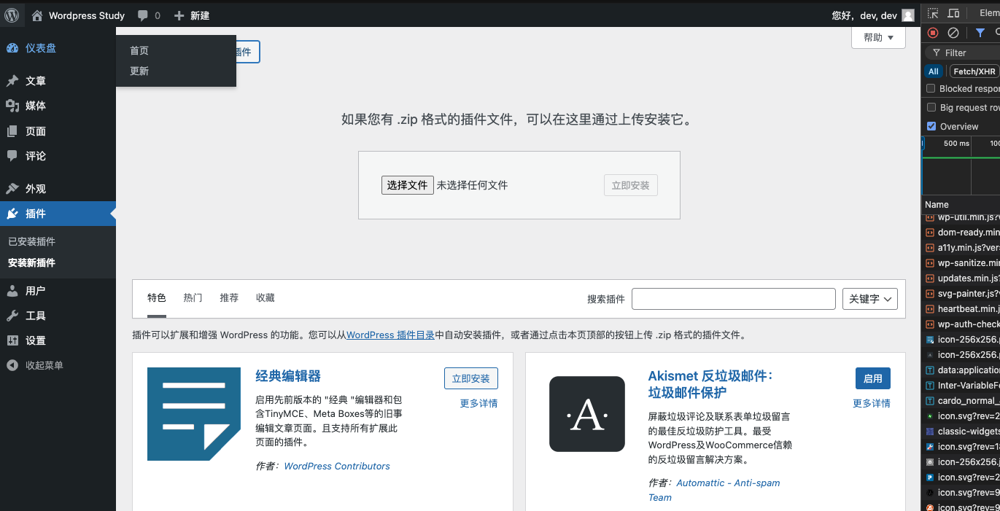
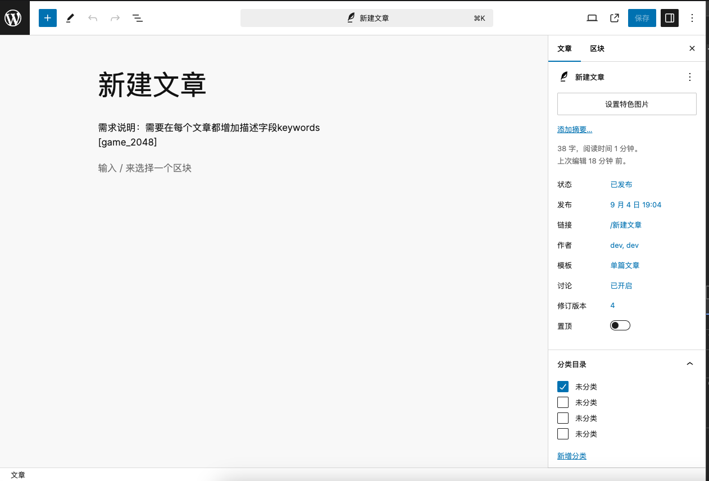
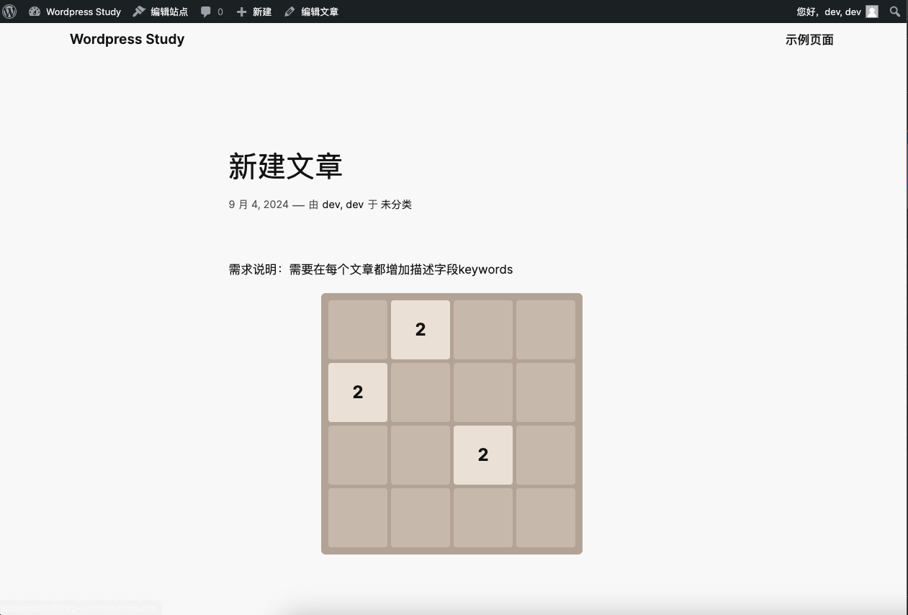
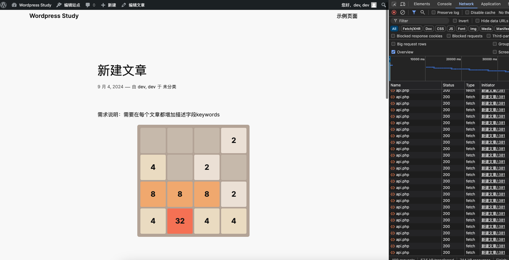

# Day20 - Wordpress｜2048小游戏插件集成

## 需求
希望Day19和Day20开发的2048可以灵活的在文章内添加或删除。

## 通过插件的形式
1. 在```wp-content/plugins/```下新增目录```2048-plugin```
2. 新增2048-game.php放置UI代码，api.php放置服务端代码
3. 修改原有请求的地址，通过```plugin_dir_url(__FILE__)```获取地址
```js
const response = await fetch('api.php')
const response = await fetch('<?php echo plugin_dir_url(__FILE__); ?>api.php');
```
4. 通过添加```add_shortcode```注册一个短代码 [game_2048]，用于将游戏嵌入页面。
```php
// 将原有逻辑嵌入函数game_2048_shortcode
function game_2048_shortcode() {}
add_shortcode('game_2048', 'game_2048_shortcode');
```
```php
// ob_start() 和 ob_get_clean() 是输出缓冲控制函数，用于管理和处理输出的内容。

// 作用:
// ob_start()：
// 启动输出缓冲：开始输出缓冲，之后的输出会被存入缓冲区，而不是直接发送到浏览器。
// 常见用途：用于截获输出内容，以便在需要时修改或测量其内容。
// ob_get_clean()：
// 获取并清空缓冲区内容：返回当前缓冲区的内容，然后清空缓冲区。
// 常见用途：用于获取生成的 HTML 内容，将其作为字符串返回或存储。
```
5. api.php直接迁移
6. 现在可以开启插件，进行操作预览。后续也可以通过压缩整个目录为zip的方式在页面中上传。

7. 使用：希望显示游戏的页面或帖子中，添加短代码 [game_2048]



