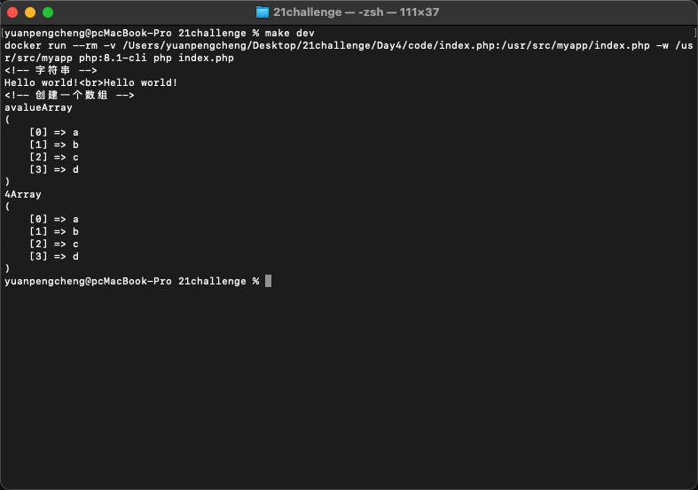
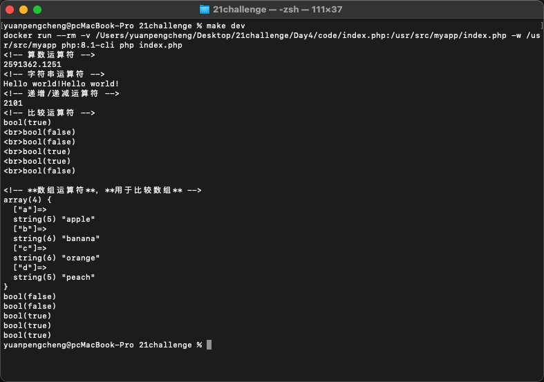

# Day 4 - 字符串、数组、运算符

## 字符串
   字符串的定义比较简单，可以使用单引号或者双引号
```php
<?php 
    $x = "Hello world!";
    echo $x;
    echo "<br>"; 
    $x = 'Hello world!';
    echo $x;
?>
```
## 数组

1. **创建一个数组**
    ```php
    $array = array('a', 'b', 'c');
    $array = ['a', 'b', 'c'];
    ```
2. **访问**
    ```php
    echo $array[0]; // 输出: a
    ```
3. **修改**
    ```php
	$array[0] = 'x';
    ```
4. **添加数组元素**
    ```php
    $array[] = 'd'; // 向数组末尾添加一个元素
    $array['key'] = 'value';// 添加键值对
    ```
5. **删除数组元素**
    ```php
    unset($array[key]); // 删除索引key处的元素
    ```

## 常用数组函数
1. `count()`: 获取数组长度。 
    ```php
    echo count($array);
    ```
2. `array_merge()`: 合并一个或多个数组。
    ```php
	$array1 = ['a', 'b'];
	$array2 = ['c', 'd'];
	$result = array_merge($array1, $array2);
    ```
3. `array_push()`: 将一个或多个元素添加到数组末尾。 
    ```php
    array_push($array, 'e', 'f');
    ```
4. `array_pop()`: 删除数组中的最后一个元素。 `array_pop` 返回数组的最后一个值。如果数组是空的，或者不是一个数组，将返回 `NULL`。
5. `array_unshift()`: 在数组开头添加一个或多个元素。
6. `array_shift()`: 移除数组开头的一个元素。
7. `array_keys()`: 获取数组所有键。
8. `array_values()`: 获取数组所有值。
9. `in_array()`: 检查数组中是否存在某个值。
10. `array_key_exists()`: 检查数组里是否存在指定键.
11. `sort()` / `rsort()` / `asort()` / `ksort()` / `arsort()` / `krsort()`：
    ```php
    sort() - 以升序对数组排序
    rsort() - 以降序对数组排序
    asort() - 根据值，以升序对关联数组进行排序
    ksort() - 根据键，以升序对关联数组进行排序
    arsort() - 根据值，以降序对关联数组进行排序
    krsort() - 根据键，以降序对关联数组进行排序
    ```
    
12. `array_slice()`: 截取数组的一部分。
13. `array_unique()`: 删除数组中重复的值。数组去重。

**运行情况**
 
## 运算符
php中的运算和其他大部分语言类似
1. **算数运算符**
- `+`：加 `$x + $y`
- `-`：减 `$x - $y`
- `*`：乘 `$x * $y`
- `/`：除 `$x / $y`
- `%`：取模	`$x % $y`

```php
<?php 
    $x=17; 
    $y=8;
    echo($x + $y); // 输出 25
    echo($x - $y); // 输出 9
    echo($x * $y); // 输出 136
    echo($x / $y); // 输出 2.125
    echo($x % $y); // 输出 1
?>
```
2. **赋值运算符**
- `x = y`：`x = y`
- `x += y`：`x = x + y`
- `x -= y`：`x = x - y`
- `x *= y`：`x = x * y`
- `x %= y`：`x = x % y`
```php
<?php 
    $x=17; 
    echo $x; // 输出 17

    $y=17; 
    $y += 8;
    echo $y; // 输出 25

    $z=17;
    $z -= 8;
    echo $z; // 输出 9

    $i=17;
    $i *= 8;
    echo $i; // 输出 136

    $j=17;
    $j /= 8;
    echo $j; // 输出 2.125

    $k=17;
    $k %= 8;
    echo $k; // 输出 1
?>
```
3. **字符串运算符**
- `.`：串接
- `.=`：**串接赋值**
```php
<?php
    $a = "Hello";
    $b = $a . " world!";
    echo $b; // 输出 Hello world!

    $x="Hello";
    $x .= " world!";
    echo $x; // 输出 Hello world!
?>
```
4. **递增/递减运算符**
- `++$x`：前递增，先$x 加一递增，然后返回 $x
- `$x++`：后递增，先返回 $x，然后 $x 加一递增
- `--$x`：前递减，先$x 减一递减，然后返回 $x
- `$x--`：后递减，先返回 $x，然后 $x 减一递减
```php
<?php
    $x=1; 
    echo ++$x; // 输出 2

    $y=1; 
    echo $y++; // 输出 1

    $z=1;
    echo --$z; // 输出 0

    $i=1;
    echo $i--; // 输出 1
?>
```
5. **比较运算符**
- `==`：等于，如果 $x 等于 $y，则返回 true。
- `===`：全等（完全相同），如果 $x 等于 $y，且它们类型相同，则返回 true。
- `!=`：不等于，如果 $x 不等于 $y，则返回 true。
- `<>`：等于，如果 $x 不等于 $y，则返回 true。
- `!==`：不全等（完全不同），如果 $x 不等于 $y，或它们类型不相同，则返回 true。
- `>`：大于，如果 $x 大于 $y，则返回 true。
- `<`：小于，如果 $x 小于 $y，则返回 true。
- `>=`：大于或等于，如果 $x 大于或者等于 $y，则返回 true。
- `<=`：小于或等于，如果 $x 小于或者等于 $y，则返回 true。
```php
<?php
    $x=17; 
    $y="17";

    var_dump($x == $y);
    echo "<br>";
    var_dump($x === $y);
    echo "<br>";
    var_dump($x != $y);
    echo "<br>";
    var_dump($x !== $y);
    echo "<br>";

    $a=17;
    $b=8;

    var_dump($a > $b);
    echo "<br>";
    var_dump($a < $b);
?>
```
6. **逻辑运算符**
- `and`｜`&&`：与，如果 $x 和 $y **都为 true**，则返回 true
- `or`｜`||`：或，如果 $x 和 $y **至少有一个为 true**，则返回 true
- `xor`：异或，如果 $x 和 $y **有且仅有一个为 true**，则返回 true
- `!`：非，如果 $x **不为 true**，则返回 true

7. **数组运算符**，**用于比较数组**
```php
+     联合 ｜ $x + $y ｜ $x 和 $y 的联合（但不覆盖重复的键）	
==    相等 ｜ $x == $y ｜ 如果 $x 和 $y 拥有相同的键/值对，则返回 true。	
===   全等 ｜ $x === $y ｜ 如果 $x 和 $y 拥有相同的键/值对，且顺序相同类型相同，则返回 true。	
!=    不相等 ｜ $x != $y ｜ 如果 $x 不等于 $y，则返回 true。	
<>    不相等 ｜ $x <> $y ｜ 如果 $x 不等于 $y，则返回 true。	
!==   不全等 ｜ $x !== $y ｜ 如果 $x 与 $y 完全不同，则返回 true。
```
```php
<?php
    $x = array("a" => "apple", "b" => "banana"); 
    $y = array("c" => "orange", "d" => "peach"); 
    $z = $x + $y; // $x 与 $y 的联合
    var_dump($z);
    var_dump($x == $y);
    var_dump($x === $y);
    var_dump($x != $y);
    var_dump($x <> $y);
    var_dump($x !== $y);
?>
```
**运行情况**
