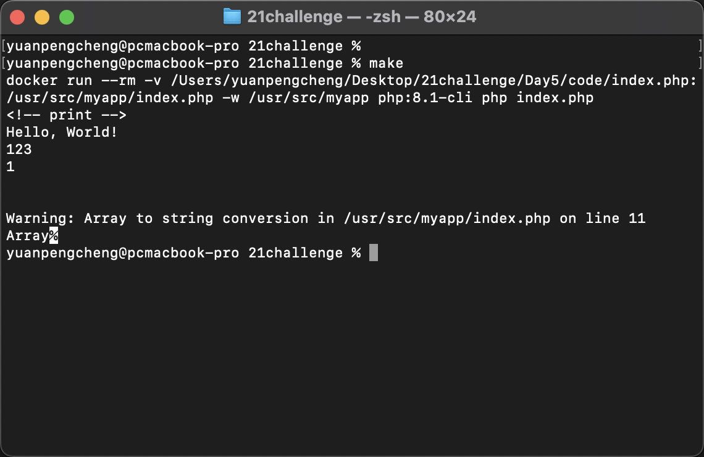
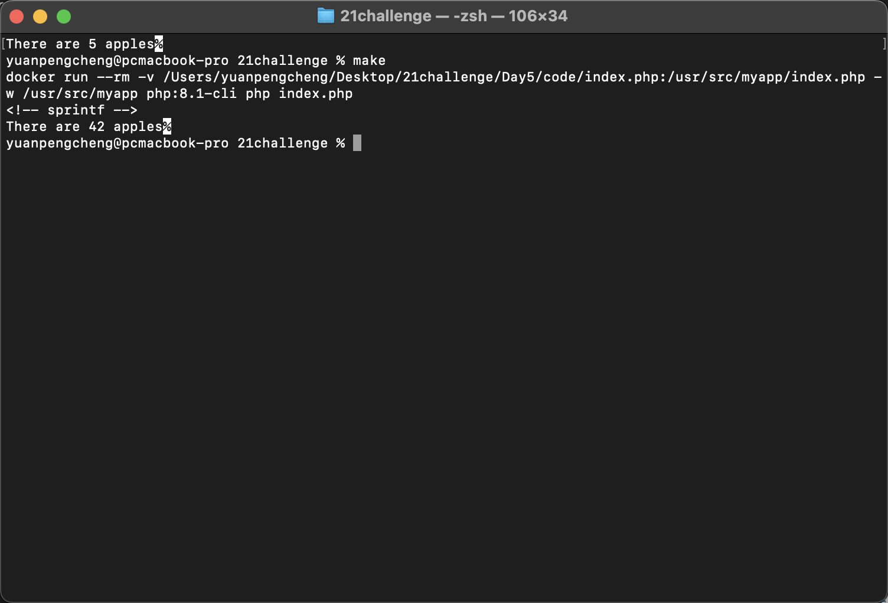

# Day 5 - 输出、函数、对象
## 输出
- **echo**
  1. 输出字符串，**可接受多个参数**。
  2. 会将数字、布尔值转为字符串
  3. 不支持输出数组和对象
  ```php
    <?php
      echo "Hello, World!\n";  // 输出一个字符串
      echo "Json", "Docker\n";  // 输出一个字符串
      echo 123;              // 输出一个数字（转换为'123'）
      echo "\n";
      echo true;              // 输出一个布尔值（转换为'1'）
      echo "\n";
      echo false;              // 输出一个布尔值（转换为''）
      echo "\n";
      $array = [1, 2, 3, 4, 5, 6, 7];
      echo $array;              // error 
    ?>
  ```
  
  
- **print**
  1. 输出字符串，**只接受1个参数**。
  2. 会将数字、布尔值转为字符串
  ```php
    <?php
      print "Hello, World!\n";  // 输出一个字符串
      print "Json\n";  // 输出一个字符串
      print 123;              // 输出一个数字（转换为'123'）
      print "\n";
      print true;              // 输出一个布尔值（转换为'1'）
      print "\n";
      print false;              // 输出一个布尔值（转换为''）
      print "\n";
      $array = [1, 2, 3, 4, 5, 6, 7];
      print $array;              // error 
    ?>
  ```
  
  
- **print_r**
  1. 可以输出数组和对象的结构，是人类可读的格式，常用于调试。
  2. 也可以输出字符串和数字，但主要用于复合数据类型
  3. 对于对象，输出对象的类名和属性
  ```php
    <?php
      print_r("Hello, World!\n");  // 输出一个字符串
      print_r("Json\n");  // 输出一个字符串
      print_r(123);              // 输出一个数字（转换为'123'）
      print_r("\n");
      print_r(true);              // 输出一个布尔值（转换为'1'）
      print_r("\n");
      print_r(false);              // 输出一个布尔值（转换为''）
      print_r("\n");
      $array = [1, 2, 3, 4, 5, 6, 7];
      print_r($array);              // error 
    ?>
  ```
  
  
- **var_dump**
  1. 支持输出所有数据类型。
  2. 输出变量的详细类型信息，包括数据类型和值
  ```php
    <?php
      var_dump("Hello, World!\n");  // 输出一个字符串
      var_dump("Json\n");  // 输出一个字符串
      var_dump(123);              // 输出一个数字（转换为'123'）
      var_dump("\n");
      var_dump(true);              // 输出一个布尔值（转换为'1'）
      var_dump("\n");
      var_dump(false);              // 输出一个布尔值（转换为''）
      var_dump("\n");
      $array = [1, 2, 3, 4, 5, 6, 7];
      var_dump($array);               
    ?>
  ```
  
  
  
- **var_export**
  1. 输出任何类型变量的字符串表示形式，生成合法的 PHP 代码（**能够创建与当前变量或数据结构等效的 PHP 代码字符串。这个字符串可以直接用在 PHP 脚本中来重建该数据结构）**。
  2. 常用语调试，代码生成和记录复杂数据结构。
  3. 对于对象，只输出有关类的基本信息（不能准确描述对象）。
  ```php
    <?php
      var_export("Hello, World!\n");  // 输出一个字符串
      var_export("Json\n");  // 输出一个字符串
      var_export(123);              // 输出一个数字（转换为'123'）
      var_export("\n");
      var_export(true);              // 输出一个布尔值（转换为'1'）
      var_export("\n");
      var_export(false);              // 输出一个布尔值（转换为''）
      var_export("\n");
      //处理数组
      $array = [1, 2, 3, 4, 5, 6, 7];
      var_export($array);  
      var_export("\n");
      
      // 处理对象
      class Fruit {
        public $name;
        public function __construct($name) {
          $this->name = $name;
        }
      }

      $fruit = new Fruit('apple'); 
      var_export($fruit);  // 对于对象，只输出有关类的基本信息（不能准确描述对象） 
      var_export("\n");
               
      // 返回值用法
      $array = array('apple', 'banana', 'cherry');
      $exported = var_export($array, true);
      echo $exported;
      // 或将其写入文件，用于持久化的数据保存
      file_put_contents('data.php', '<?php return ' . $exported . ';');
    ?>
  ```
  

- **sprintf**
  1. 用于格式化字符串的函数
  2. **自身不输出**，而是返回格式化后的字符串
  3. 支持对各种数据类型进行格式化并返回字符串。
  ```php
    <?php
    $formattedString = sprintf("There are %d apples", 42); // 返回字符串
    echo $formattedString;
    ?>
  ```
  
  
- **printf**
  1. 用于格式化字符串的函数,格式化**并直接输出结果**。
  2. 主要用于格式化输出。
  ```php
    <?php
      printf("There are %d apples", 1100); // 输出格式化数字作为字符串
    ?>
  ```
  

- **error_log**
  1. 输出错误信息到日志，通过将信息作为字符串写入。
  2. 通常用于字符串信息的记录，不用于直接在屏幕上显示。
  **语法**
  ```php
    bool error_log(string $message, int $message_type = 0, string $destination = null, string $extra_headers = null)
    // 参数解释
    $message: 要记录的错误信息字符串。
    $message_type（可选）: 指定发送错误信息的方式。
      0（默认）：发送到 PHP 的系统日志，通常是 web 服务器的错误日志文件。
      1: 发送邮件。这要求 $destination 参数包含邮件地址。
      3: 将信息追加到文件。此时需要指定 $destination 文件路径。
      2: 在 Windows 平台上向调试器发送信息。
    $destination（可选）: 根据message_type的不同，表示邮件地址或文件的地址。
    $extra_headers（可选）: 当message_type为1，可以指定额外的邮件头部信息（例如From，Cc，Bcc等）
  ```
  ```php
    <?php
      error_log("This is an error message."); // 记录日志信息
    ?>
  ```
  
  
  
## 函数
1. **定义和调用函数**
  ```php
  <?php
    function functionName($parameter1, $parameter2)
    {
        $result = $parameter1 + $parameter2;
        // 函数体
        return $result; // 可选：返回值
    }
    function add($a, $b)
    {
        return $a + $b;
    }
    $result = add(2, 3); // 调用 add 函数
    printf($result); // 输入为 5
  ?>
  ```
2. **默认参数**
  ```php
    <?php
      function greet($name = "Guest") {
          echo "Hello, $name!";
      }

      greet(); // 输出: Hello, Guest!
      greet("Alice"); // 输出: Hello, Alice!
      // 可变参数（可变长度参数）
      function sum(...$numbers) {
          return array_sum($numbers); // 返回值 通过 return 关键字, 如果未指定 return 语句，默认返回 NULL。
      }

      echo sum(1, 2, 3, 4); // 输出: 10
    ?>
  ```
3. **局部和全局作用域**
  ```php
    <?php
      // 局部变量： 函数内部声明的变量默认为局部变量，仅在函数内部可用
      function testLocalScope() {
          $x = 5; // 局部变量
      }
      // echo $x; // 错误：$x 未定义
      
      // 全局变量
      $globalVar = 10;

      function testGlobalScope() {
          global $globalVar;
          echo $globalVar; // 输出: 10
      }

      function testGlobalsArray() {
          echo $GLOBALS['globalVar']; // 输出: 10
      }
    ?>
  ```
4. **匿名函数和闭包**
  ```php
    <?php
      // 匿名函数（闭包）
      $sayHello = function($name) {
          echo "Hello, $name";
      };

      $sayHello("World"); // 输出: Hello, World 
      
      // 闭包使用 use
      // 通过 use 关键词将外部变量引入到匿名函数中
      
      $message = "Hello";
      $exampleClosure = function($name) use ($message) {
          echo "$message, $name";
      };

      $exampleClosure("Alice"); // 输出: Hello, Alice
      
      // 不能直接使用外部定义的变量  
      $message = "Hello";
      $exampleClosure = function($name) {
          echo "$message, $name"; // 会导致错误：未定义的变量 $message
      };

      $exampleClosure("Alice");
    ?>
  ```
  
  
## 对象
1. **通过类（class）来创建**
2. **类和对象**
    >类（Class）: 类是对象的模板，定义了一组属性和方法。
    对象（Object）: 对象是类的实例，使用类定义的属性和方法。
3. **定义类**
   ```php
   class Car {
    // 属性（字段）
      public $color;
      public $model;

      // 构造方法
      public function __construct($color, $model) {
          $this->color = $color;
          $this->model = $model;
      }

      // 方法
      public function info() {
          return "This car is a " . $this->color . " " . $this->model . ".";
      }
   }
   ```
   **访问修饰符**：定义类的属性和方法的可见性
   - ***public***: 可以被任何代码访问，无论是否位于类的内部，是最开放的访问级别
   - ***protected***: 只能在类内部以及该类的子类中访问。在类外部的实例不能访问受保护的成员。*
   - ***private***:仅在类内部可访问，子类和类的实例都不能访问。是最严格的访问控制，限制性最高。

3. **创建对象**
    ```php
    $car1 = new Car("red", "Toyota");
    echo $car1->message(); // 输出: This car is a red Toyota.

    $car2 = new Car("blue", "Ford");
    echo $car2->message(); // 输出: This car is a blue Ford.
    ```
5. **访问属性和方法**
    - 使用 `->` 访问对象的属性和方法。
    - `$this` 在类内部用于指代当前对象实例。
