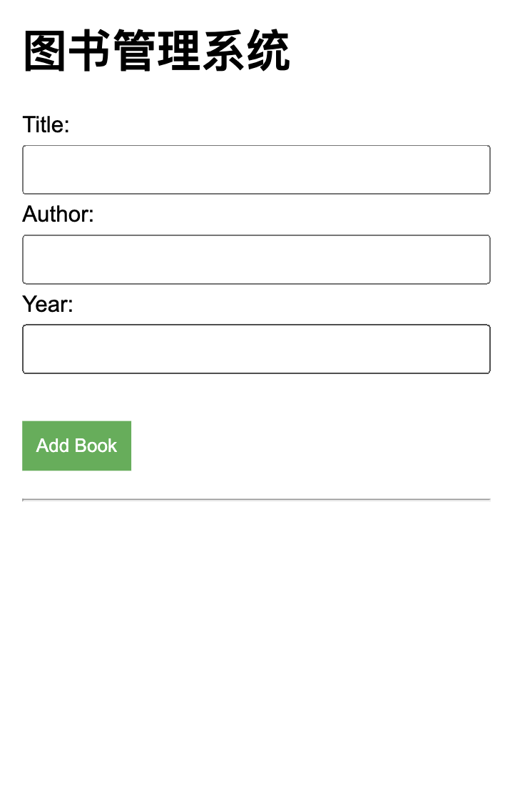
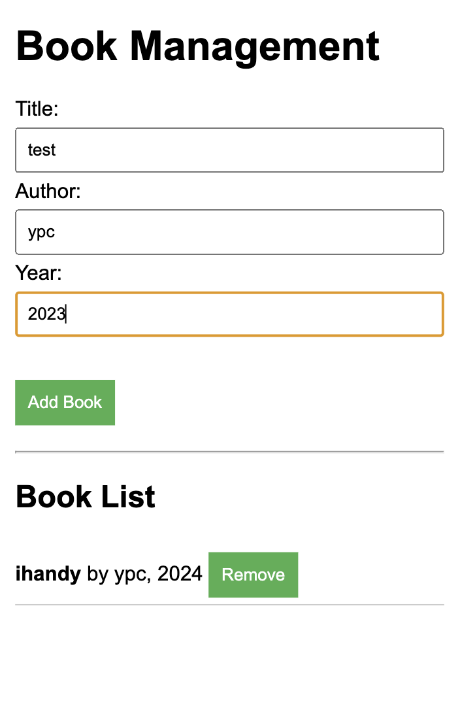

# Day 6 - 结合Day1-5 实现一个图书管理系统

## 前言
Day1 到 Day5学习了PHP的基础知识，涉及了PHP的特性、变量声明、基础语法、数据类型、条件控制、循环语句、数组、运算符、输出、函数以及对象等多个方面。根据所学的PHP知识，实现一个简单的图书管理系统。

## 项目概述
该项目是一个简单的图书管理系统，允许用户添加和删除书籍。
- 逻辑层和会话管理：PHP
- 界面UI：HTML 和 CSS
- 部署：Docker

## 代码结构
- `index.php`: 主应用程序文件，处理图书的添加、删除及显示。
- `Book.php`: Book类的定义文件。
- `style.css`: 定义了项目的样式。
- `Docker`：用于在Docker中部署运行应用程序。

## 实现思路
1. **Book**类
    实现图书管理系统，从人类的角度来看，必然存在一个`书`的概念，所有的事情(**CURD**)都在围绕书开展。因此，先定义一个书的类。

    ```php
    class Book{}
    ```

    现在引入了`书`这一概念，通过 `Book` 类来表示每一本书。在这个类中，每本书都有其自身的属性，如书名、作者及出版年份等。这些属性描述了书的基本信息，代码如下

    ```php
    <?php
    class Book
    {
        public $title;
        public $author;
        public $year;
    }

    ```

    现在定义好了这个书的三个属性，但是现在属性值还没有被填写。我们需要支持填写属性

    ```php
    <?php
    class Book
    {
        public $title;
        public $author;
        public $year;

        public function __construct($title, $author, $year)
        {
            $this->title = $title;
            $this->author = $author;
            $this->year = $year;
        }
    }

    ```

    这样一个基本的Book类就实现了，我们可以在任何需要的地方通过`new`来创建一个Book的实例
    ```php
    new Book('ihandy', 'ypc', '2024')
    ```
2. **界面UI**

    上述代码实现了Book类，可以在需要的地方快速的创建一个Book实例。下面要通过`HTML5`和`CSS`实现**界面UI**，实现`Book`的可操作性。
    html部分
    ```html
    <!DOCTYPE html>
        <html lang="en">
        <head>
            <meta charset="UTF-8">
            <meta name="viewport" content="width=device-width, initial-scale=1.0">
            <title>图书管理系统</title>
            <link rel="stylesheet" href="style.css">
        </head>

        <body>
            <h1>图书管理系统</h1>
            <form method="post">
                <input type="hidden" name="action" value="add">
                <label for="title">Title:</label><br>
                <input type="text" id="title" name="title" required><br>
                <label for="author">Author:</label><br>
                <input type="text" id="author" name="author" required><br>
                <label for="year">Year:</label><br>
                <input type="number" id="year" name="year" required><br><br>
                <button type="submit">Add Book</button>
            </form>
        </body>
    </html>
    ```
    css部分
    ```css
    body {
        margin: 20px;
        font-family: Arial, sans-serif;
    }
    form {
        margin-bottom: 20px;
    }
    input[type="text"],
    input[type="number"] {
        margin: 5px 0;
        padding: 8px;
        width: calc(100% - 20px) !important;
    }
    button {
        margin-top: 10px;
        padding: 10px;
        border: none;
        background-color: #4caf50;
        color: white;
        cursor: pointer;
    }
    button:hover {
        background-color: #45a049;
    }
    ul {
        padding: 0;
        list-style-type: none;
    }
    li {
        margin-bottom: 10px;
        padding-bottom: 5px;
        border-bottom: 1px solid #ccc;
    }
    ```


3. **添加图书操作逻辑**
    ```php
    <?php
    // 自动加载类，自动加载Book类，这允许可以不使用include或者require导入Book类
    spl_autoload_register(function ($class_name) {
        include $class_name . '.php';
    });

    session_start(); // 会话管理。 用于存储和管理书籍列表。
    
    // 初始化书籍列表
    if (!isset($_SESSION['bookList'])) {
        $_SESSION['bookList'] = [];
    }

    // 添加书籍
    function addBook($title, $author, $year)
    {
        $book = new Book($title, $author, $year);
        $_SESSION['bookList'][] = $book;
    }

    // 删除书籍
    function removeBook($index)
    {
        if (isset($_SESSION['bookList'][$index])) {
            array_splice($_SESSION['bookList'], $index, 1);
        }
    }
    ```
    
4. **添加图书的列表UI**
    ```php
    // 使用 htmlspecialchars() 将 HTML 字符转化为实体，以避免 XSS（跨站脚本攻击）等安全问题，从而安全地展示用户输入的数据。
    <ul>
        <?php foreach ($_SESSION['bookList'] as $index => $book): ?>
            <li>
                <strong><?php echo htmlspecialchars($book->title); ?></strong> by <?php echo htmlspecialchars($book->author); ?>, <?php echo htmlspecialchars($book->year); ?>
                <form method="post" style="display:inline;">
                    <input type="hidden" name="action" value="remove">
                    <input type="hidden" name="index" value="<?php echo $index; ?>">
                    <button type="submit">Remove</button>
                </form>
            </li>
        <?php endforeach; ?>
    </ul>
    ```

5. **这样一个基本的图书管理系统就完成了，可以根据功能通过继承，多态等在Book类中拓展相应的逻辑**
