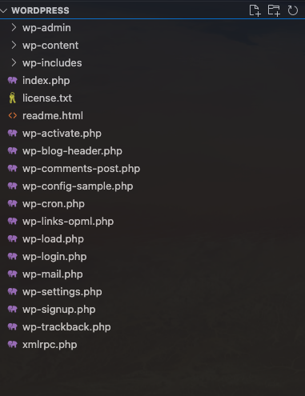
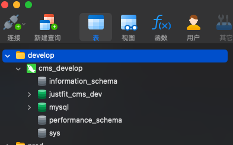
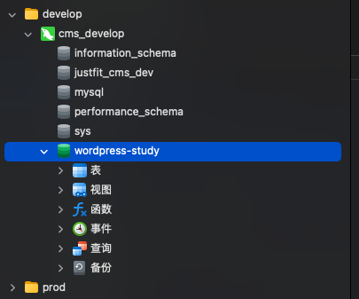
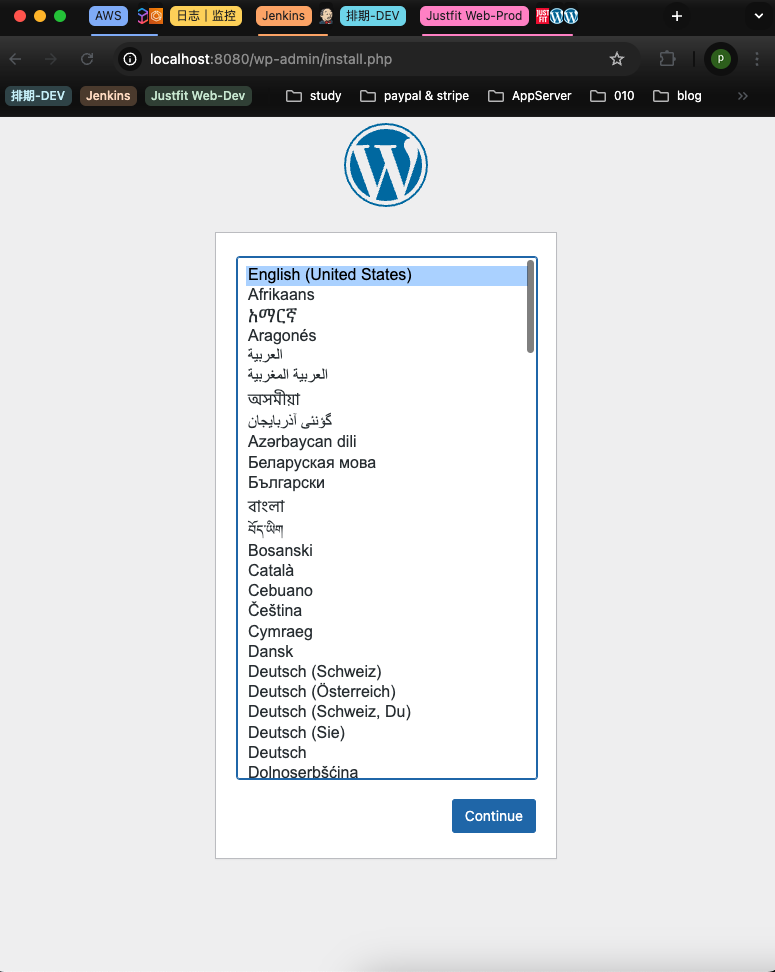
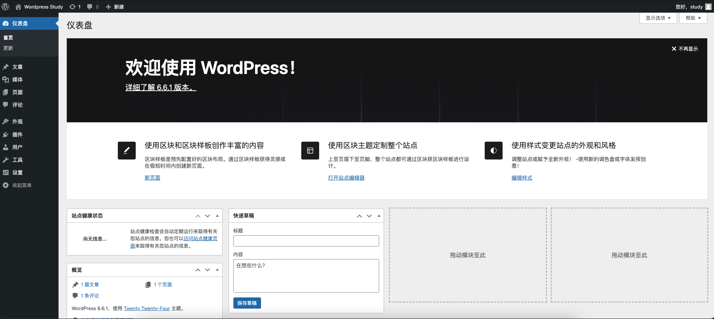

# Day 7 - 第一个Wordpress

## 什么是 WordPress？
WordPress 是一个开源内容管理系统（CMS），用于创建和管理网站。它基于 PHP 和 MySQL，最初用于博客发布，但现在已经发展成为一个强大的工具，可以用来建立各种类型的网站。

## WordPress 的主要功能
1. **易用性**
界面用户体验友好，适合从初学者到经验丰富的开发者使用，无需具备编程知识即可开始创建网站
2. **主题和设计**
主题众多，用户可以轻松改变网站的外观和设计风格
3. **插件扩展**
通过插件扩展功能，用户可以增加如搜索引擎优化（SEO）、社交媒体集成、电子商务、优化性能等丰富多样的功能。
4. **媒体管理**
内置的媒体库管理功能，允许用户方便地上传、编辑和管理图像、视频、音频等文件。
5. **SEO友好**
WordPress 符合标准的生成代码，以及大量 SEO 插件的支持，使得优化搜索引擎变得更简单。
6. **多用户和多角色管理**
可以为网站的不同用户分配特定角色和权限，便于管理内容发布和网站维护。
7. **社区和支持**
WordPress 拥有一个庞大而活跃的用户和开发者社区，提供支持、主题、插件以及持续的改进和更新。

## WordPress 能做什么
1. **博客和个人网站**
最初为博客而设计，WordPress 仍然是个人网站和博客的理想选择。
2. **商业网站**
通过强大的商业主题和插件，可以创建包括功能齐全的商业网站。
3. **电子商务网站**
使用 WooCommerce 等插件，WordPress 可以转变为功能强大的在线商店。
4. **作品集和展示网站**
艺术家、设计师和摄影师可以利用 WordPress 创建令人印象深刻的在线作品集。
5. **新闻网站和杂志**
许多大型新闻机构和杂志使用 WordPress 来创建并管理动态内容丰富的网站。
6. **教育和网络课程网站**
通过插件和自定义功能，可以创建提供在线课程和教育资源的网站。

## WordPress下载
本次学习我们将会clone下Wordpress的源码，并进行适度的二开。目前Wordpress官方的稳定版本是6.6.1。

> Wordpress源码下载地址：https://wordpress.org/download

**Wordpress目录结构**


## 配置Wordpress
1. 数据库安装
   选用Mysql做为Wordpress的数据库，可以采用镜像安装或者本机安装Mysql。本次学习介绍使用镜像安装Mysql。
   - 安装`docker`
   官网下载安装包 https://www.docker.com/
   - 安装`mysql-8.0.32`，**将mysql容器3306端口映射道本地端口3306**
   ```docker
   docker run --name mysql-8.0.32 \
      --restart always \
      -e MYSQL_ALLOW_EMPTY_PASSWORD=yes \
      -p 3306:3306 \
      -v ~/docker/mysql:/var/lib/mysql \
      -d mysql:8.0.32
   ```
2. 连接数据库
   采用可视化工具navicat
   
3. 新建数据库wordpress-study
   
4. 配置wp-config.php
   重命名`wp-config-sample.php`为`wp-config.php`，添加数据库信息。
   ```php
   <?php
   // ** Database settings - You can get this info from your web host ** //
   /** The name of the database for WordPress */
   define('DB_NAME', 'wordpress-study');

   /** Database username */
   define('DB_USER', 'root');

   /** Database password */
   define('DB_PASSWORD', '');

   /** Database hostname */
   define('DB_HOST', '127.0.0.1:3306');

   /** Database charset to use in creating database tables. */
   define('DB_CHARSET', 'utf8');

   /** The database collate type. Don't change this if in doubt. */
   define('DB_COLLATE', '');

   /**#@+
   * @since 2.6.0
   */
   define('AUTH_KEY',         'tG~5<qJnRsnWWtc;9c)&glJnex+Q:c9y;pR4*a&!Jd<C_.+ko7)yH!!?H_yt0`C3');
   define('SECURE_AUTH_KEY',  'SV|%U9)Q/E.L-VvNfRg]8Vop@#_<Lt?K]V|suiGk}(2+cUN|JsKU#>x!F23^VX)b');
   define('LOGGED_IN_KEY',    '*o1|@Dy5D|t*$,0IP1<4DzH5ml*r-H@2g@VCa}9CgmLf=!O@`cxAHuy0Cc*lGIM}');
   define('NONCE_KEY',        'K=3?t^;n2_+bJ*J++Gw]x2ImPQF@V:j=`2;c7:;6T*bVW8+n9_YX] |iGdLw0=yB');
   define('AUTH_SALT',        'tPu+9cQ%5;;^o9gGKa7lu+:yD8-Ph,Q3W-~Wsc|c%@?LeU.%`1~9/M6#I;n_EKz!');
   define('SECURE_AUTH_SALT', 'C.P[`Tz?9?F1iW~=H9x= N!hQ;ROJ9`1u1QH$3SJaWirZ`dp7M=`R^n;ouUw,t*/');
   define('LOGGED_IN_SALT',   'q920Nz80v-OZT}Q[,Ti=jZy42!.w&hn?Pv{~2zUQ+o(dmu{@k-5d.fh0mCR:%_~Z');
   define('NONCE_SALT',       'W~G>-]AR3Ur}7YM75`[/}v:PMMv]Kjqs)x/xx,H|QNeFuXl8?5vleb?L,M)||P)Y');

   /**#@-*/

   /**
   * WordPress database table prefix.
   *
   * You can have multiple installations in one database if you give each
   * a unique prefix. Only numbers, letters, and underscores please!
   */
   $table_prefix = 'wp_';

   /**
   * @link https://developer.wordpress.org/advanced-administration/debug/debug-wordpress/
   */
   define('WP_DEBUG', false);

   /* Add any custom values between this line and the "stop editing" line. */

   /* That's all, stop editing! Happy publishing. */

   /** Absolute path to the WordPress directory. */
   if (! defined('ABSPATH')) {
      define('ABSPATH', __DIR__ . '/');
   }

   /** Sets up WordPress vars and included files. */
   require_once ABSPATH . 'wp-settings.php';


   /* Add any custom values between this line and the "stop editing" line. */
   define('WP_HOME', 'http://localhost:8080');
   define('WP_SITEURL', 'http://localhost:8080');

   ```
5. 新建一个`Makefile`用来保存构建命令
   ```Makefile
   # 定义变量
   ARG_PROJECT_NAME=wordpress-study# 项目名称
   ARG_CONTAINER_WORKDIR=/var/www/html# docker工作目录

   dev:
      docker run --rm --network host -v .:$(ARG_CONTAINER_WORKDIR) --name $(ARG_PROJECT_NAME) trafex/php-nginx

   ```
6. 执行`make dev`
   我们打开localhost:8080就进入了wordpress的初始化页面，跟随wordpress的指示配置自定义网站即可
   
   **wordpress dashboard**
   
   