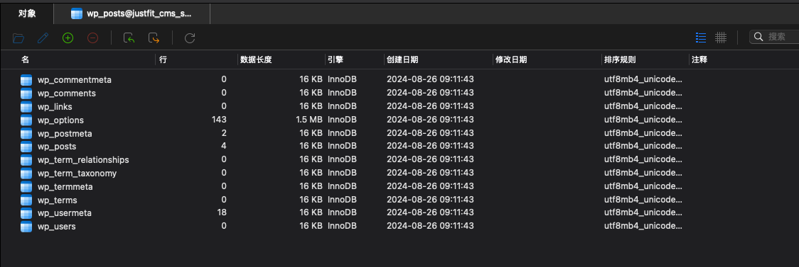
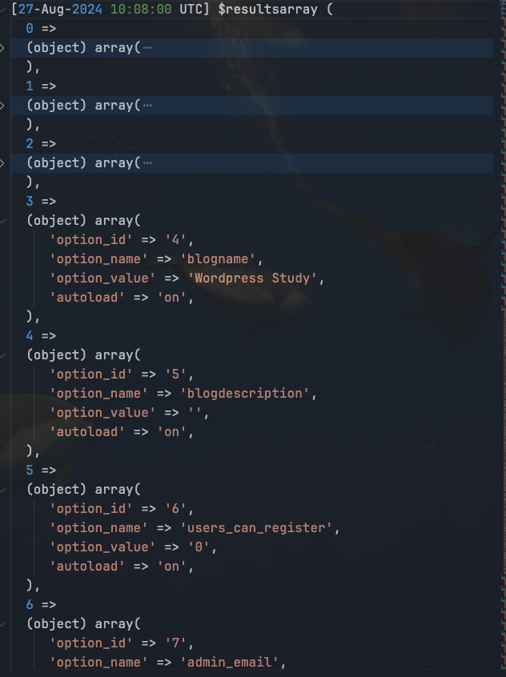

# Day 8 - Wordpress｜数据库

Day7 已经成功打开了第一个wordpress项目，今天学习wordpress的数据库结构以及wordpress提供的一些有关数据库操作的方法。

## 数据库表概览



**列举基础表和几个重要的字段**

1. **wp_posts**: 网站数据，如文章、页面、附件和自定义文章类型
@import "code/wp_posts.csv"
1. **wp_postmeta**: 文章相关联的元数据，如自定义字段
@import "code/wp_postmeta.csv"
1. **wp_terms**: 所有分类法中的项目，比如分类和标签
@import "code/wp_terms.csv"
1. **wp_term_taxonomy**: 描述类目的组织方式，定义是分类还是标签
@import "code/wp_term_taxonomy.csv"
1. **wp_term_relationships**: 关联文章ID和分类法项目ID
@import "code/wp_term_relationships.csv"
1. **wp_users**: 存储网站用户信息
@import "code/wp_users.csv"
1. **wp_usermeta**: 存储与用户相关的元数据
@import "code/wp_usermeta.csv"
1. **wp_options**: 站点的各种全局配置和选项
@import "code/wp_options.csv"
1. **wp_comments**: 评论
@import "code/wp_comments.csv"
1.  **wp_commentmeta**: 与评论相关的元数据
@import "code/wp_commentmeta.csv"

## 数据获取
wordpress实现了全局 `$wpdb` 对象用于数据库交互。
在使用 `$wpdb` 查询数据库时，确保在代码中先全局化 `$wpdb` 对象
```php
global $wpdb;
```
**查询数据**
1. **get_results**: 用来获取多行结果。返回包含对象的数组。
   ```php
    global $wpdb;
    $results = $wpdb->get_results("SELECT * FROM $wpdb->posts WHERE post_status = 'publish'", OBJECT);
    foreach ($results as $post) {
        echo $post->post_title;
    }
    // OBJECT 是默认返回类型可以省略，也可以显示的选择 ARRAY_A（关联数组）或 ARRAY_N（数值数组）。
   ```
2. **get_row**: 用来获取单行结果。返回对象
   ```php
    global $wpdb;
    $row = $wpdb->get_row("SELECT * FROM $wpdb->posts WHERE ID = 1", OBJECT);
    echo $row->post_title;
   ```
3. **get_var**: 用来获取单个变量（单列和单行结果）。
   ```php
    global $wpdb;
    $post_title = $wpdb->get_var("SELECT post_title FROM $wpdb->posts WHERE ID = 1");
    echo $post_title;
   ```
4. **get_col**: 用来获取单列结果。返回一个列数组。
   ```php
    global $wpdb;
    $titles = $wpdb->get_col("SELECT post_title FROM $wpdb->posts");
    foreach ($titles as $title) {
        echo $title;
    }
   ```
5. **insert**,**update**,**delete**
   ```php
    global $wpdb;
    
    $wpdb->insert(
        $wpdb->posts,
        array(
            'post_title' => 'Sample Post',
            'post_content' => 'This is a sample post content.',
            'post_status' => 'publish'
        );
    )
    $wpdb->update(
        $wpdb->posts,
        array('post_title' => 'Updated Title'), // 数据的设置
        array('ID' => $post_id) // WHERE 条件
    );
    $wpdb->delete(
        $wpdb->posts,
        array('ID' => $post_id)
    );
   ```
6. **prepare**: 为了防止 SQL 注入，始终使用 $wpdb->prepare() 构建查询：
   ```php
    global $wpdb;
    $post_author = 1;

    $prepared_query = $wpdb->prepare("SELECT * FROM $wpdb->posts WHERE post_author = %d", $post_author);
    $results = $wpdb->get_results($prepared_query, OBJECT);

    foreach ($results as $post) {
        echo $post->post_title;
    }
   ```
7. `$wpdb->prefix`: 获取当前的表前缀，一般在wp-config.php统一配置`$table_prefix = 'wp_';`
   
8. 通过`$wpdb->options`直接获取当前表，无需通过`$wpdb->prefix`拼接
   ```php
   $wpdb->options 等同于 wp_options
   ```

## 实战
查询wp_options中所有内容,
在wp-content/themes/twentytwentyfour/functions.php新增逻辑，通过get_results获取所有信息，并输出到debug.log文件中。
```php
function get_options_content()
{
	global $wpdb;
	$results = $wpdb->get_results("SELECT * FROM $wpdb->options");
	error_log('$results' . var_export($results, true));
}
add_action('init', 'get_options_content');
```

